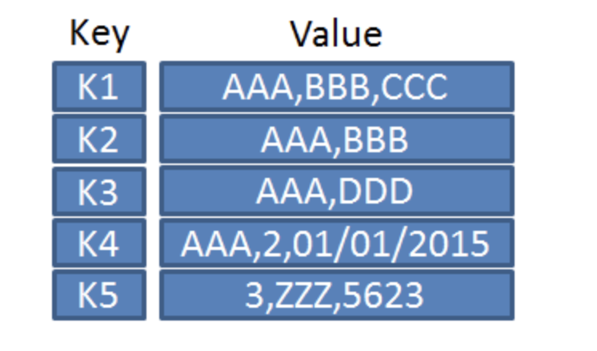
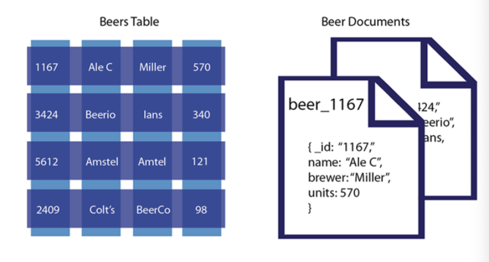
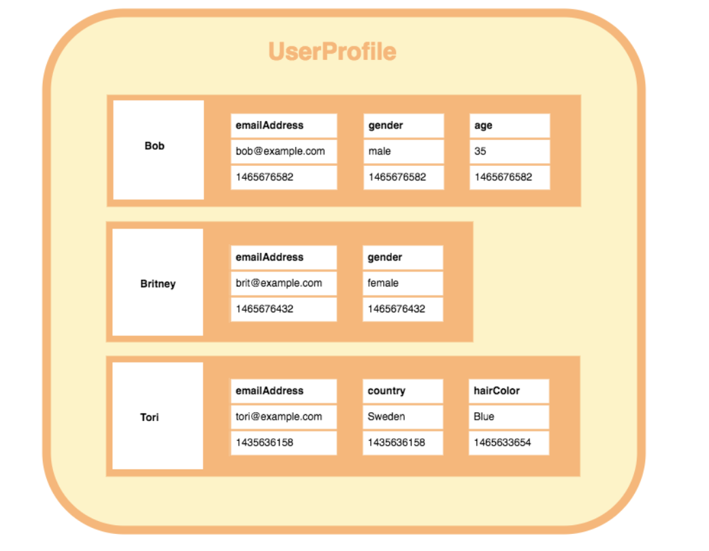
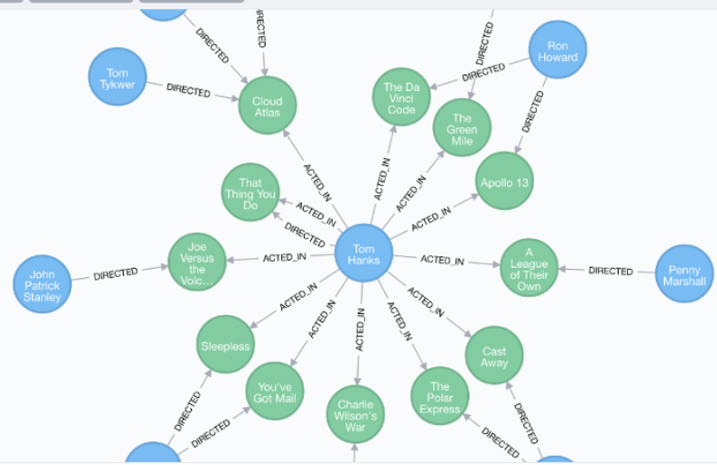

# TL;DR

- **`데이터 베이스 (Database, DB)`**란 ? 데이터의 저장소
- **`데이터 베이스 관리 시스템(DBMS)`**이란? 데이터 베이스를 운영하고 관리하는 소프트웨어
- **`SQL`** 이란? 구조화된 질의 언어라는 뜻으로 관계형 데이터 베이스에서 사용되는 언어
- **`NoSQL`** 이란?

- **`클러스터링`** vs **`리플리케이션`** : DB를 수평적, 수직적으로 확장하는 두 가지 방법
- **`DB샤딩`** : DB 트래픽을 분산할 목적으로 데이터를 분산해서 저장하는 기법

   

# 들어가기 전에

#### 데이터 베이스를 사용하는 이유

데이터 베이스 이전에는 파일 시스템을 이용해 데이터를 관리했다. 이때 어플리케이션과 상호 연동이 되어야할 때 `종속성` 문제나 `데이터 무결성` 문제가 발생해 파일 시스템으로는 관리하기 한계가 있었다. 

데이터 베이스는 이런 데이터 관련 문제를 해결해주는, 조직화된 데이터의 모음을 의미한다.

> ☝️ 여기서 잠깐!
>
> - 데이터의 종속성 (Dependency) : 프로그램의 구조가 데이터의 구조에 영향을 받는 것으로, 데이터의 구조가 변경되면 프로그램까지 같이 바뀌어야 하므로 프로그램 개발과 유지보수가 어렵다.
>
> - 데이터의 중복성 (Redundancy) : 파일 시스템은 프로그램마다 데이터 공유가 안되는 경우가 많아서 같은 정보를 중복해서 저장하는 경우도 많다. 저장 공간의 낭비이기도 하지만, 데이터 관리 측면에서 같은 정보를 여러 공간에 보관하면 수정 시 모든 데이터를 수정해야 한다는 문제가 발생한다.
>
> - 데이터의 무결성 (Integrity) : 데이터의 내용이 본래의 의도와 다른 형식을 갖게될 때 무결성이 침해됐다고 말한다. 데이터가 여러 경로를 통해 들어오기 때문에 잘못된 데이터가 들어오는 경우를 의미한다.

  

#### 데이터 베이스 관리 시스템(DBMS)이란?

- 데이터 베이스를 관리하고 운영하는 소프트웨어
- 데이터 베이스를 구축하는 틀을 제공하고, 효율적으로 데이터를 검색/저장하는 기능을 제공하고, 응용 프로그램들이 데이터 베이스에 접근할 수 있는 인터페이스를 제공하는 등의 기능을 한다.

- DBMS의 종류
  - MySQL, MariaDB, Oracle, SQLite, DB2, SQL Server, PostgreSQL, ...
  - 계층형(Hierarchical), 망형(Network), 관계형(Relational), 객체지향형(Object-Oriented), 객체관계형(Object-Relational) 등으로 분류할 수 있으나 현재는 RDBMS를 제외하고는 거의 사용되지 않는다.

 

#### 관계형 데이터 베이스란?

- 데이터를 열(column)과 행(row)으로 구성된 테이블(table)에 저장
- 각 열은 하나의 속성에 대한 정보를 저장하고, 행은 각 열의 데이터 형식에 맞는 데이터가 저장된다.
- 테이블의 구조와 데이터 타입 등을 사전에 정의하고, 해당 테이블에 알맞은 형태의 데이터만 삽입할 수 있다.

 

#### SQL 이란?

> Structured Query Language

- 관계형 데이터 베이스에서 사용되는 언어
- 관계형 데이터 베이스에서 모두 SQL이라는 언어를 사용하므로 관계형 데이터 베이스를 총칭해서 SQL이라고 부르기도 한다.

 

> ☝️ 여기서 잠깐!
>
> SQL은 누가 만드나요?
>
> - 국제 표준화 기구에서 SQL에 대한 표준을 정해서 발표하고 있고, 이를 표준 SQL이라고 한다. 
> - 다만 표준 SQL이 각 회사의 DBMS 특성을 모두 포용하지 못하기 때문에 표준 SQL을 준수하되 각 제품의 특성을 추가한 SQL을 사용한다.
> - Oracle은 PL/SQL, SQL Server는 T-SQL, MySQL은 SQL로 명칭한다.

  

#### 비관계형 데이터 베이스의 등장 배경

관계형 데이터 베이스는 20년 이상 데이터 베이스 시장을 지배했는데, 기술과 빅데이터 응용 프로그램이 발전함에 따라 SQL 기반 데이터베이스는 빠르게 확장되는 데이터의 양과 복잡해지는 데이터 구조를 처리하기에 한계에 부딪혔다. 이를 해결하기 위해 CPU나 메모리를 추가하는 방편을 사용했지만 이 방식은 비싸고 임시 방편일 뿐이었다.

대표적인 인터넷 기업이면서 대용량 단순 데이터를 많이 보유해 단순 대용량 데이터 처리에 대한 요구가 가장 많은 구글과 아마존에 의해 Bigtable과 Dynamo라는 논문이 발표되었고, 이 두 논문은 새로운 데이터 저장 기술을 만들어내는 시발점이 됐다.

결국 대용량 데이터 관리 작업에 필요한 유연하고, 확장 가능하며, 비용적으로 효율적이면서 높은 가용성을 가지는 데이터 베이스 스키마를 재설계하게 됐고, 이것이 NoSQL이다.

   

# NoSQL

> Not Only SQL

- 비관계형 데이터 베이스
- 관계형 데이터 베이스 이외의 형식으로 데이터를 저장하는 데이터 베이스를 총칭

- Document, Graph, Key-Value, Column Store 등의 방식이 있다.

 

#### 특징

- RDBMS와 달리 데이터 간의 관계를 정의하지 않는다.
  - 관계형 데이터 베이스가 데이터의 관계를 Foreign Key 등으로 정의하고 이를 이용해 Join 등의 관계형 연산을 한다고 한다면, NoSQL은 데이터 간의 관계를 정의하지 않는다.

- RDBMS에 비해 훨씬 대용량의 데이터를 저장 가능

- 분산형 구조를 통해 여러 대의 서버에 분산해 저장하고 상호 복제해 데이터 유실이나 서비스 중지에 대비 가능 `확장성` `가용성`
  - RDBMS는 보통 하나의 고성능 머신에 데이터를 저장함
- 고정되지 않은 테이블 스키마 (테이블의 스키마가 유동적) `유연성`
  - 데이터 베이스 설계를 변경하지 않고도 필요한 속성을 동적으로 추가할 수 있다.
- 읽기 작업보다 쓰기 작업이 더 빠르고, 일반적으로 RDBMS에 비해 쓰기와 읽기 성능이 빠르다. `고성능`
  - 대량의 데이터를 빠르게 처리하기 위해 메모리에 임시 저장하고 응답하는 등의 방법을 사용

 

## NoSQL 종류

### Key-Value DB

> Redis, Oracle NoSQL, Voldemorte, ...

- Amazon의 Dynamo Paper에서 유래

- Key와 Value의 쌍으로 데이터가 저장되는 유형 

- Key는 값에 접근하기 위한 용도이고 (Unique 값)

  Value에는 어떤 형태의 데이터(이미지, 비디오 포함)도 담을 수 있다.

- 간단한 API를 제공해 질의 속도가 굉장히 빠름

 

#### 언제 사용하는게 좋을까?

1. 성능 향상을 위해 관계형 데이터 베이스에서 데이터 캐싱
2. 모바일 어플리케이션용 사용자 데이터 정보와 구성 정보 저장
3. 이미지나 오디오 파일 같은 대용량 객체 저장

  

### Doument DB

> MongoDB, Azure Cosmos DB, CouchDB, ...

- Lotus Notes에서 유래
- JSON, XML과 같은 계층적 트리 데이터 방식으로 저장
- 관계형 DB에서 여러 개의 테이블 데이터를 하나의 Document에 모아둘 수 있음
  - 컬럼 (Schema) 없고, Document 내 객체는 서로 다른 필드를 가질 수 있음
- 데이터를 여러 서버에 분산 저장이 가능하고 복제와 회복이 가능한 형태라 장애가 발생해도 대응에 유리하다.
- 단점이라면 쿼리가 SQL과 다르고, 질의 결과가 JSON이나 XML 형태로 출력된다는 점

 

#### 언제 사용하는게 좋을까?

1. 대용량 데이터를 읽고 쓰는 웹 사이트용 백엔드 지원
2. 다양한 유형의 메타 데이터 추적
3. JSON 데이터 구조를 사용하는 어플리케이션

  

### Wide Column DB

> HBase, Cassandra, Hypertable, ...

- Big Table DB라고도 하며, Google의 BigTable Paper에서 유래
- Column Family 데이터 모델을 사용
- 행마다 키와 해당값을 저장할 때마다 각각 다른 값의 다른 수의 스키마를 가질 수 있음
  - 사용자 이름(Key)에 해당하는 값에 스키마들이 각각 다름
- 대량의 데이터의 압축, 분산 처리, 집계 처리 및 쿼리 동작 속도 그리고 확장성이 뛰어남

 

#### 언제 사용하는게 좋을까?

- 열이 모든 행에 대해 항상 동일하지 않고, 여러 데이터 베이스 노드에 분산될 수 있는 대규모 데이터 셋이 필요할 때 사용하는 것이 이상적

1. Log data 저장
2. 주식 거래 데이터나 기온 모니터링 데이터 등 시계열 데이터 저장

  

### Graph DB

> Neo4J, Blasegraph, OrientDB

- Euler & Graph Theory에서 유래
- 노드, 엣지, 프로퍼티와 함께 그래프 구조를 사용해 데이터를 표현하고 저장
- 질의가 그래프 순회를 통해 이루어진다.

- RDBMS보다 성능이 좋고 유연하며 유지보수에 용이하다.
- 클러스터링에 적합하지 않고 질의 언어도 특화되어 있어 배우기 어렵다.

 

#### 언제 사용하는게 좋을까?

- 데이터 간의 관계가 탐색의 키일 경우

  1. 페이스북이나 트위터 같은 SNS 에서 내 친구의 친구를 찾는 질의 등에 적합하고,

  2. 연관된 데이터를 추천해주는 추천 엔진이나 패턴 인식 등의 데이터 베이스로도 적합

 

## NoSQL vs SQL

#### 1) 스키마

- DB의 구조, 제약조건에 관한 명세
  - 개체의 특징을 나타내는 **속성(Attribute)**
  - 속성들의 집합으로 이루어진 **개체(Entity)**
  - 개체 간 존재하는 **관계(RelationShip)**

|      | SQL                                        | NoSQL                                                        |
| ---- | ------------------------------------------ | ------------------------------------------------------------ |
| 1    | Table에 데이터가 저장됨                    | Document에 저장됨 Document가 모여 Collection Collection이 모여 Database |
| 2    | Row, Col 구조                              | Key-Value 형태로 데이터 저장                                 |
| 3    | 스키마를 정의 해야 데이터를 저장할 수 있음 | 스키마를 정의하지 않아도 된다.                               |

  

#### 2) Relation(관계)

|      | SQL                                                 | NoSQL                                                        |
| ---- | --------------------------------------------------- | ------------------------------------------------------------ |
| 1    | SQL에서 가장 중요                                   | Join 이란 개념이 없음                                        |
| 2    | Table간의 관계(Join)을 통해 데이터를 파악할 수 있음 | Users 의 데이터가 Orders에 다 담김. -> Join을 통해 확인 X    |
| 3    | 데이터를 중복 없이 저장 가능(정규화 필요)           | Collections 별로 중복된 데이터 존재 -> 업데이트 할 때 주의 필요 |

  

#### 3) Scalability(확장)

|      | SQL                  | NoSQL                    |
| ---- | -------------------- | ------------------------ |
| 특징 | **Vertical**         | **Horizontal**           |
|      | = Scale up           | = Scale out              |
|      | 성능을 향상시키는 것 | 더 많이 서버를 늘리는 것 |

  

#### 4) Property(특성)

|      | SQL                                                          | NoSQL                                                        |
| ---- | ------------------------------------------------------------ | ------------------------------------------------------------ |
| 특징 | **ACID**                                                     | **CAP**                                                      |
|      | 트랜잭션이 안전하게 수행되도록 보장하는 것                   | CAP 의 Consistency나 Avaliability를 포기해 분산 확장성을 보장 |
|      |                                                              | 트랜잭션 ACID를 느슨하게 유지                                |
|      | Atomicity(원자성) : 트랜잭션의 작업이 부분적으로 실행되거나 중단되지 않는 것을 보장 |                                                              |
|      | Consistency(일관성) : 미리 정의된 규칙에서만 수정이 가능한 특성 (숫자 컬럼에 문자열 값 저장 안되도록 보장) | Consistency (일관성) : 모든 요청은 최신 데이터 또는 에러를 응답  (DB가 3개로 분산되었다고 가정할 때, 하나의 특정 DB의 데이터가 수정되면 나머지 2개의 DB에서도 수정된 데이터를 응답받아야 한다.) |
|      | Isolation(고립성) : 트랜잭션 수행시 다른 트랜잭션의 작업이 끼어들지 못하도록 보장 | Availability (가용성) : 모든 요청은 정상 응답을 받는다. (특정 DB가 장애가 나도 서비스가 가능해야 한다.) |
|      | Durability(영구성) : 성공적으로 수행된 트랜잭션은 영원히 반영 | Partitions Tolerance (분리 내구성) : DB간 통신이 실패하는 경우라도 시스템은 정상 동작 |

  

### 그래서 둘 중에 뭘 선택해야 하는가?

정답은 없다. 어떤 데이터를 다루느냐에 따라 달라진다.

 

#### SQL 데이터 베이스 사용이 더 좋을 때

- 관계를 맺고 있는 데이터가 자주 변경되는 어플리케이션
- 변경될 여지가 없는 명확한 스키마가 사용자와 데이터에게 중요한 경우
- 데이터베이스의 ACID 성질을 준수해야 하는 경우 (금융 서비스)

 

#### NoSQL 데이터 베이스 사용이 더 좋을 때

- 정확한 데이터 구조를 알 수 없거나 변경/확장 될 수 있는 경우

- 읽기를 자주 하지만, 데이터 변경은 자주 없는 경우
- 데이터베이스를 수평으로 확장해야 하는 경우 (막대한 양의 데이터를 다뤄야 하는 경우)

   

# Replication vs Clustering

- 리플리케이션은 여러 개의 DB를 수직적인 구조(Master-Slave)로 구축하는 방식
- 클러스터링은 여러 개의 DB를 수평적인 구조로 구축하는 방식

 

## Replication

- 여러 개의 DB를 권한에 따라 수직 구조로 구축하는 방식. 
- Master Node는 쓰기 작업만, Slave Node는 읽기 작업만. 
- 비동기 방식으로 노드 데이터 동기화

 

1. Master Node에 쓰기 작업 실행
2. 데이터를 저장하고 트랜잭션 로그를 파일에 기록(BinLog)
3. Slave Node IO Thread는 BinLog를 복사
4. Slave 노드의 SQL Thread는 파일을 읽으며 데이터 저장

 

#### 장점

- 읽기 작업이 많은 DB 요청에서는 Replication만으로 충분히 성능 높이기 가능
- 비동기 방식이라 지연 시간이 거의 없음

 

#### 단점

- Master 노드가 다운되면 복구, 대처가 까다로움
- 동기화가 보장되지 않아 일관성 있는 데이터 신뢰 불가

  

## Clustering

- 여러 개의 DB를 수평 구조로 구축하는 방식.  (데이터 베이스 서버 확장)
- Fail Over 시스템을 구축하기 위해 사용. 
  - 데이터 베이스가 동작하지 않으면 전체 서비스가 동작할 수 없다는 점을 해결하기 위해 Clustering을 통해 데이터 베이스 서버를 늘린다.
- 동기 방식으로 노드들 간의 데이터 동기화

 

1. 1개의 노드에 쓰기 트랜잭션 수행
2. 실제 디스크에 내용을 쓰기 전에 다른 노드로 데이터 복제 요청
3. 다른 노드에서 복제 요청 수락 신호를 보내고, 디스크에 쓰기 시작
4. 다른 노드로부터 신호를 받으면 실제 데이터 저장

 

#### 장점

- 노드들 간의 데이터를 동기화하여 일관성 있는 데이터 신뢰
- 1개의 노드가 죽어도 다른 노드가 살아있어, 시스템을 장애 없이 운영

 

#### 단점

- Replication에 비해 쓰기 성능이 떨어짐
- 장애가 전파된 경우 처리가 까다로움.

   

# Sharding

- 같은 테이블 스키마를 가진 데이터를 다수의 데이터베이스에 분산하여 저장하는 방법.

  = Horizontal Partitioning

- DB 트래픽을 분산할 목적

- 다수의 복제본으로 구성하고 각 샤드에 어떤 데이터가 저장될 지를 Shard Key를 기준으로 분리한다.

- Shard Key를 어떻게 정의하느냐에 따라 데이터를 효율적으로 분산시키는 것이 결정됨

 

 

### 샤딩 적용시 문제점 및 고려사항

1. 데이터 재분배 (Rebalancing Data)
   - 샤딩된 DB의 물리적 한계나 성능 한계 도달 시 scale-up 작업이 필요한데,
   - 이때 서비스 정지 없이 scale-up 할 수 있도록 설계 방향 잡아야 한다.
2. 데이터 조인하기
   - 샤딩 DB 간 조인이 불가능 하므로 데이터 중복에 대한 trade-off 

3. Global Unique Key

   DBMS에서 제공하는 auto-increament를 사용하면 Key가 중복될 수 있기 때문에 어플리케이션 레벨에서 Key 생성을 담당해야 한다.

   => **라우팅을 위해 구분할 수 있는 유일한 키값이 있어야 한다.**

4. 프로그래밍 복잡도가 증가하고, 데이터가 한 쪽 샤드로 몰리면 샤딩이 무의미해짐

5. 한 번 샤딩 사용하면 샤딩 이전 구조로 돌아가기 힘들다.

 

#### 샤딩 방법

- Hash Sharding : 데이터를 어디에 넣을지 해싱하여 결정
- Dynamic Sharding : Locator Service 를 통해 동적 샤딩 키를 얻어 사용
- Entity Group : 관련된 데이터를 하나의 샤드로 사용하는 방식

   

# References

- [workhardslave/cs-study/Database](https://github.com/workhardslave/cs-study/blob/main/Database/NoSql%2C%20%ED%81%B4%EB%9F%AC%EC%8A%A4%ED%84%B0%EB%A7%81vs%20%EB%A6%AC%ED%94%8C%EB%A6%AC%EC%BC%80%EC%9D%B4%EC%85%98%2C%20DB%EC%83%A4%EB%94%A9.md)
- [데이터의 종속성/중복성/무결성](https://m.blog.naver.com/PostView.naver?isHttpsRedirect=true&blogId=utis&logNo=220472055509)
- [Database, DBMS 개념](https://hongong.hanbit.co.kr/%EB%8D%B0%EC%9D%B4%ED%84%B0%EB%B2%A0%EC%9D%B4%EC%8A%A4-%EC%9D%B4%ED%95%B4%ED%95%98%EA%B8%B0-databasedb-dbms-sql%EC%9D%98-%EA%B0%9C%EB%85%90/)

- [NoSQL 종류별 특징](https://velog.io/@swhan9404/NoSQL-%EC%9D%98-%EC%A2%85%EB%A5%98%EB%B3%84-%ED%8A%B9%EC%A7%95)
- [Replication vs Clustering](https://mangkyu.tistory.com/97)

- [DB Sharding](https://goodgid.github.io/DB-Sharding/)