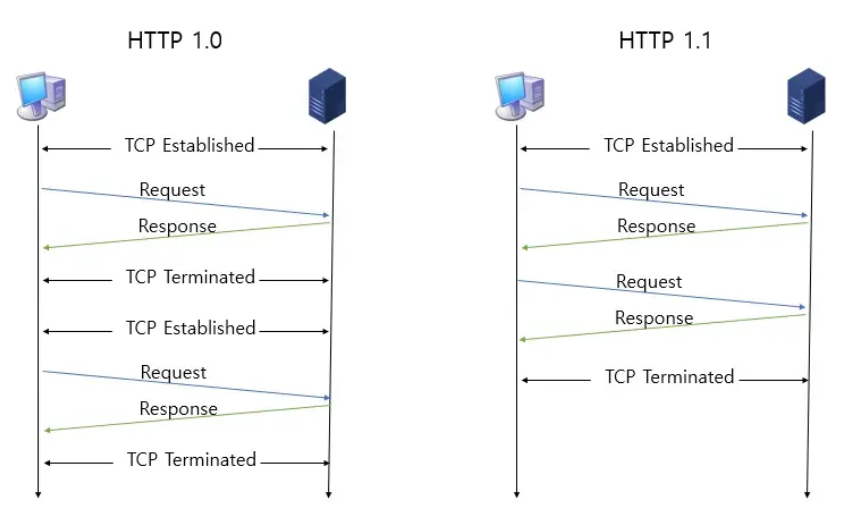
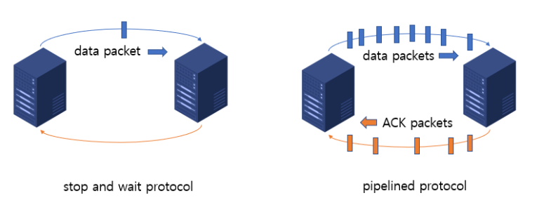
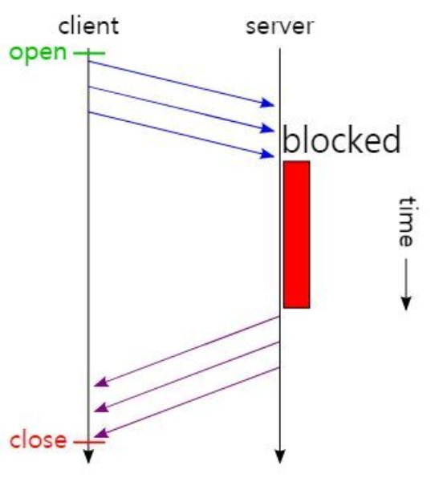
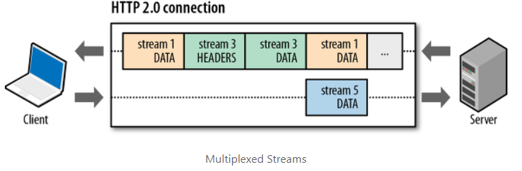
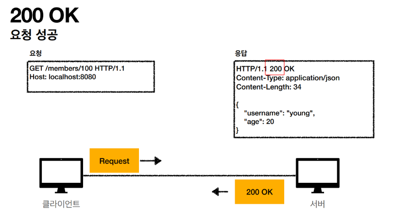
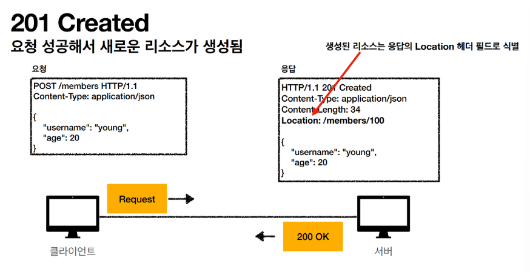
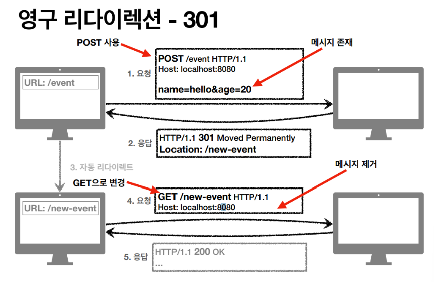

# HTTP

> HyperText Transfer Protocol
> 

웹 상에서 클라이언트와 서버 간에 `요청(request)` 와 `응답(response)` 으로 정보를 주고받을 수 있는 프로토콜.

<Br>

- Request의 예시

```
  GET <https://www.naver.com> HTTP/1.1								
  User-Agent: Chrome/5.0 (Windows NT 10.0; Win64; x64) ...			

```

- Response의 예시

```
  HTTP/1.1 200 OK														// 시작줄
  Connection: keep-alive												 // 헤더
  Content-Length: 21211
  Content-Type: text/html;

  <!DOCTYPE html><html><head><title...

```

<Br>
<Br>

# HTTP 특징

1. **서버-클라이언트 구조**

클라이언트가 서버에 요청을 보내면 서버는 그에 대한 응답을 보내는 클라이언트 서버 구조로 이루어져 있다.

<Br>

2. **비연결성(Connectionless)**

클라이언트가 어떠한 데이터를 요청하면 서버는 응답을 하고 한 번 맺었던 연결을 끊어버린다.

- 장점
    - 리소스를 아낄 수 있기 때문에 더 많은 연결을 할 수 있다.
- 단점
    - 매번 연결을 새로 맺기 때문에 시간이 발생한다.(3 way handshake)
    - 매번 새로운 연결을 해야하므로 `오버헤드`가 발생한다.
    
    > `오버헤드` 란 어떠한 처리를 하기 위해 들어가는 간접적인 처리 시간, 메모리를 말함.
    > 

<Br>

3. **무상태(Stateless)**

연결을 끊는 순간 서버는 클라이언트의 상태 정보를 유지하지 않는다.

- 장점
    - 서버의 확장에 용이하다(scale out). stateful은 특정 클라이언트를 특정 서버가 전담하는 식으로 대응한다. 따라서 동적으로 서버를 확장하기가 어렵다. 반면에 statelesss하다면 서버 호출 시 정보를 다 넘겨주기 때문에 문제가 발생해도 다른 서버를 호출해 처리가 가능하다. 따라스 스케일 아웃(같은 기능하는 서버군들의 수평 확장)에 유리하다.
- 단점
    - 클라이언트가 추가 데이터를 전송해야 한다.

<Br>
<Br>

# HTTP 버전

## HTTP 0.9 (1991년)

- 특징
    - 요청 method는 GET만 존재
    
    ```
    /* 요청 */
    GET /mypage.html
    ```
    
    - 응답도 단순. 파일 자체로만 구성됨.
    
    ```
    /* 응답 */
    <HTML>
    A very simple HTML page
    </HTML>
    ```
    
    - HTTP 헤더도 없고, HTML파일만 전송 가능했던 것이 특징

<br>


## HTTP 1.0(1996년)

- 특징
    - HTTP 헤더(`header`) 개념이 도입되어 요청과 응답에 추가
    - 버전 정보, 요청 method가 함께 전송되기 시작.
    - `Content-type` 도입으로 HTML이외의 문서 전송이 가능해짐
- 한계
    - `커넥션 하나` 당 `요청 하나` 와 `응답 하나` 만 처리가 가능. → HTTP 1.1에서 개선

```html
/* 요청 */
GET /mypage.html HTTP/1.0
User-Agent: NCSA_Mosaic/2.0 (Windows 3.1)
```

```html
/* 응답 */
200 OK
Date: Tue, 15 Nov 1994 08:12:31 GMT
Server: CERN/3.0 libwww/2.17
Content-Type: text/html
<HTML>
A page with an image
  
</HTML>
```

<br>

## HTTP 1.1(1997년)

- 특징
    - Persistent Connection : 지정한 timeout 동안 커넥션을 닫지 않아 속도가 빨라짐
    
    
    
    - 파이프라이닝(Pipelining) : 송신자가 다수의 패킷을 한 번에 보내는 것.
    
    
    
    - 호스트헤더(Host Header)
- 단점
  - HOL (Head of Line) blocking: 특정 응답의 지연. 앞 응답이 오래걸리면 뒤 요청은 `Blocking`되어버림.
    
  - 무거운 header 구조(ex. 쿠키)

<br><br>

## HTTP2.0(2015년)

- **Multiplexed Streams :** HTTP 1.1의 `HTTP Pipelining`의 개선안으로 하나의 Connection으로 동시에 여러 개의 메세지를 주고 받을 수 있음. 응답은 요청 순서에 상관없이 Stream으로 받기 때문에 `HOL Blocking`
 도 발생하지 않음



- **Stream Prioritization : 응답에 대한 우선순위를 정해 우선순위가 높을수록 응답을 빨리함.**
- **Header Compression :** Header Table과 Huffman Encoding을 사용하는 HPACK 압축방식으로 이를 개선. 클라이언트와 서버는 각각 Header Table을 관리하고 이전 요청과 동일한 필드는 table의 index만 보내고, 변경되는 값은 Huffman Encoding 후 보냄으로서 Header의 크기를 경령화.

<br>
<br>


# HTTP 상태코드

클라이언트가 서버에 보낸 요청이 어떻게 처리되었는지 보여주는 코드.

## 1xx(Informational) : 요청이 수신되어 처리중

## 2xx(Successful) : 요청 정상 처리

- **200 OK**



- 201 Created : 클라이언트 요청이 성공해서 새로운 리소스가 생성되었을 때 돌아오는 응답코드. HTTP Heder에 Location을 같이 넣어 응답한다.



- 202 Accepted : 요청이 접수되었으나 처리가 완료되지는 않았다는 뜻.
- 204 No Contented : 서버가 요청을 성공적으로 수행했지만, 응답 페이로드 본문에 보낼 데이터가 없다는 뜻. (ex. 웹문서 편집기 save 버튼)

<br>
<br>


## 3xx(Redirection) : 요청을 완료하려면 추가 행동이 필요

이때 웹 브라우저는 3xx 응답의 결과에 Location 헤더가 있으면, Location 위치로 자동 이동을 한다.(Redirect)


예전에는 /evemt라는 페이지를 배포. 하지만 현재는 /new-event 페이지만 사용중

→ 영구적으로 바뀌었기 때문에 “301 Moved Permanently”라고 응답 + “Location : /new-event”라고 알려줌.

→ 클라이언트의 웹 브라우저는 301코드와 Location 헤더를 확인한 후, URI를 new-event로 바꾸어 다시 요청을 보냄.

- 영구 리다이렉션 : 특정 리소스의 URI가 영구적으로 이동
    - 301 Moved Permanently : 영구 리다이렉션. 리다이렉트 요청 시 요청 메서드가 Get으로 변하고, 본문이 제거 될 수 있음.
    - 308 Permanent Redirect : 영구 리다이렉션. 차이점은 리다이렉트 요청 시 본문은 유지됨.


<br>




- 일시 리다이렉션 : 일시적인 변경. 잠깐 이동할 때 쓴다.(주문 완료 후 주문 내역 화면으로 이동 - 사용자 편의성 증가)
    - 302 Found : 리다이렉트 요청 시 메서드가 GET으로 변하고, 본문이 제거될 수 있음.
    - 303 See Other : 302와 기능 같음. GET으로 100프로 변경됨
    - 307 Temporary Redirect : 302와 기능 같음. 리다이렉트 시 요청 메서드와 본문을 유지.
- 특수 리다이렉션 : 결과 대신 캐시를 사용(ex. 캐시 결과가 만료된 것 같을 때, 클라이언트가 서버에 캐시가 만료된 것이 맞는지 확인. 서버가 캐시를 그대로 사용해도 된다고 알려줌)
    - 304 Not Modified : 특수 리다이랙션. 캐시를 목적으로 사용함. 클라이언트에게 리소스가 수정되지 않았다는 것을 알려줌. 클라이언트는 로컬 PC에 저장된 캐시를 재사용함.

<br>
<br>

## 4xx(Client Error) : 클라이언트 오류, 잘못된 문법 등으로 서버가 요청을 수행할 수 없음

- 400 Bad Request : 요청 구문, 메시지 등 클라이언트가 잘못된 요청을 해서 서버가 요청을 처리할 수 없음.
- 401 Unauthorized : 클라이언트가 해당 리소스를 쓰기 위해서는 인증이 필요함. • 401 오류 발생 시 응답에 WWW-Authenticate 헤더와 함께 인증 방법을 설명해줘야함
- 403 Forbidden : 서버가 사용자의 요청을 이해했지만, 승인을 거부함. (ex. 어드민 등급이 아닌 사용자가 어드민 등급의 리소스에 접근한 경우)
- 404 Not Found : 요청 리소스를 찾을 수 없음. (클라이언트가 없는걸 요청했으니, 잘못된 요청임)

> 인증(Authentication) : 유저나 디바이스의 신원을 증명하는 행위
인가(Authorization) : 유저나 디바이스에게 접근권한을 부여하거나, 거부하는 행위
> 

<br>
<br>

## 5xx(Server Error) : 서버 오류, 서버가 정상 요청을 처리하지 못함.

- 500 Internal Server Error : 서버 내부에 문제가 발생해서 오류가 발생함. 애매하면 500.
- 503 Service Unavailable : 서버에 일시적인 과부하 또는 예정된 작업으로 잠시 요청을 처리할 수 없음.


<참고자료> 

[https://velog.io/@pear/HTTP-요청과-응답](https://velog.io/@pear/HTTP-%EC%9A%94%EC%B2%AD%EA%B3%BC-%EC%9D%91%EB%8B%B5)
[https://victorydntmd.tistory.com/286](https://victorydntmd.tistory.com/286)
[https://fomaios.tistory.com/entry/Network-HTTP의-특징에-대해-알아보기feat-비연결성-무상태](https://fomaios.tistory.com/entry/Network-HTTP%EC%9D%98-%ED%8A%B9%EC%A7%95%EC%97%90-%EB%8C%80%ED%95%B4-%EC%95%8C%EC%95%84%EB%B3%B4%EA%B8%B0feat-%EB%B9%84%EC%97%B0%EA%B2%B0%EC%84%B1-%EB%AC%B4%EC%83%81%ED%83%9C)
[https://hanamon.kr/네트워크-http-http란-특징-무상태-비연결성/](https://hanamon.kr/%EB%84%A4%ED%8A%B8%EC%9B%8C%ED%81%AC-http-http%EB%9E%80-%ED%8A%B9%EC%A7%95-%EB%AC%B4%EC%83%81%ED%83%9C-%EB%B9%84%EC%97%B0%EA%B2%B0%EC%84%B1/)
[https://ojt90902.tistory.com/647?category=928801](https://ojt90902.tistory.com/647?category=928801)
[https://velog.io/@neity16/HTTP-HTTP-버전-별-특징](https://velog.io/@neity16/HTTP-HTTP-%EB%B2%84%EC%A0%84-%EB%B3%84-%ED%8A%B9%EC%A7%95)
[https://code-lab1.tistory.com/196](https://code-lab1.tistory.com/196)
[https://code-lab1.tistory.com/27](https://code-lab1.tistory.com/27)
https://haerang94.tistory.com/207
https://ssungkang.tistory.com/entry/%EB%84%A4%ED%8A%B8%EC%9B%8C%ED%81%AC-HTTP-11-VS-HTTP-20