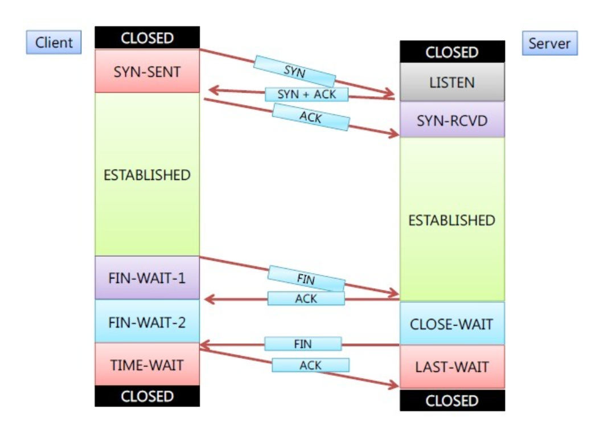
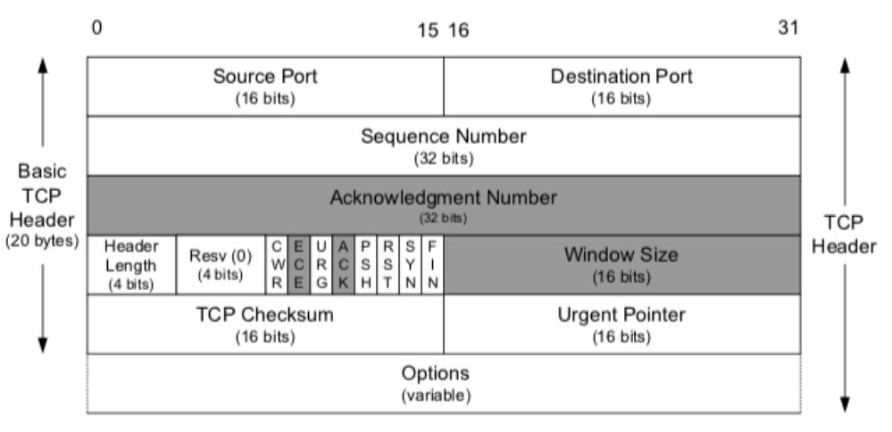
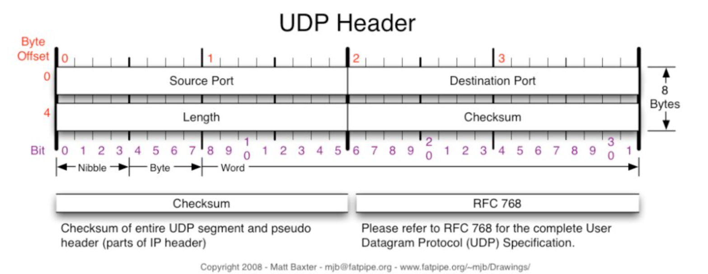

# TCP UDP

## Internet Protocol Suite
`인터넷 프로토콜 스위트(Internet Protocol suit)`는 인터넷에서 컴퓨터들이 정보를 주고받는데 쓰이는 프로토콜의 집합이다. 대표적으로 `TCP/IP`의 4계층 모델로 설명하거나 `OSI` 7계층 모델이 있다.

 

- **TCP/IP**  
> ☝️여기서 잠깐!  
>
> `TCP/IP`는 단순히 `TCP`와 `IP`만 일컫는 말이 아니라, 여러 가지 프로토콜의 조합을 의미한다. 다만 `TCP`와 `IP`가 가장 많이 사용되며 중요하기 때문에 그렇게 불리운다.

 

| 4    | **애플리케이션(응용)** **계층**                    | FTP, HTTP, SSH, SMTP, DNS … |
| ---- | ------------------------------------ | ------------------------------------------------------------ |
| 3    | **전송 계층**                   | TCP, UDP, DCCP, SCTP, IL, RUDP, …                            |
| 2    | **네트워크** **계층**                  | IP (IPv4, IPv6), ARP, RARP(주소 결정 프로토콜)|
| 1  | **데이터링크 계층**                              |  IEEE 802, SDLC, HDLC …                              |

 

- **OSI 7 계층**

> ☝️여기서 잠깐!  
>
> `OSI`계층은 `애플리케이션 계층`을 세 개로 쪼개고(애플리케이션 계층, 프레젠테이션 계층, 세션 계층), `링크 계층`을 두 개로 쪼개는(데이터 링크 계층, 물리 계층)것이 차이점이다.

 

| 7    | **애플리케이션(응용)** **계층**            | HTTP, SMTP, SNMP, FTP, 텔넷, SSH & Scp, NFS, RTSP            |
| ---- | ---------------------------- | ------------------------------------------------------------ |
| 6    | **프레젠테이션(표현)** **계층**            | XDR, ASN.1, SMB, AFP                                         |
| 5    | **세션** **계층**            | TLS, SSL, ISO 8327 / CCITT X.225, RPC, 넷바이오스, 애플토크  |
| 4    | **전송** **계층**            | TCP, UDP, RTP, SCTP, SPX, 애플토크                           |
| 3    | **네트워크** **계층**        | IP, ICMP, IGMP, X.25, CLNP, ARP, RARP, BGP, OSPF, RIP, IPX, DDP |
| 2    | **데이터** **링크** **계층** | 이더넷, 토큰`링, PPP, HDLC, 프레임 릴레이, ISDN, ATM, 무선랜, FDDI |
| 1    | **물리** **계층**            | 전선, 전파, 광섬유, 동축케이블, 도파관, PSTN, 리피터, DSU, CSU, 모뎀 |

 

---

## 전송(Transport layer) 계층

 

- OSI 7계층 중 4계층
- 호스트들 간에 통신을 제공.
- 역할
    1) 데이터가 제대로 도착했는지 확인
    2) 전송된 데이터의 목적지가 어떤 애플리케이션인지 식별
- 목적지에 신뢰할 수 있는 데이터를 전달하기 위해 필요
- 오류를 점검하는 기능이 있어 오류 발생 시 데이터를 재전송하도록 요청함

 
☝️전송 계층의 프로토콜인 TCP와 UDP를 비교해보자.

 

----

 

## TCP(Transmission Control Protocol)

 

TCP는 네트워크 상에서 확실한 데이터의 전송을 보장하므로 데이터의 신뢰성이 보장된다. 또한 전송에 에러가 발생한 경우 자동으로 데이터를 재전송한다.

### 특징

1. 접속형(Connection-Oriented)  
    - TCP를 사용하는 두 어플리케이션(보통 클라이언트와 서버)가 데이터 교환하기 전에 접속이 성립되어야 한다.    
    - 3 way handshaking : 연결 초기화 방법
      - [step1] A(클라이언트)가 B(서버)에 접속을 요청하는 `SYN` 패킷 보냄. A는 응답 기다리는 상태(SYN-SENT)
      - [step2] B는 `SYN`을 받고 요청을 수락하는 `ACK`와 `SYN flag`를 보냄. B는 A의 응답 기다림.(SYN_RECEIVED) 상태
      - [step3] A는 B에게 `ACK`를 보냄.
    - 4 way handshaking : 세션 종료 방법
      - [step1] A(클라이언트)가 연결 종료하겠다는 `FIN플래그` 전송
      - [step2] B(서버)는 확인 메시지 보내고, 자신의 통신이 끝날 때까지 기다림.(TIME-WAIT상태)
      - [step3] B(서버)가 통신이 끝났으면 연결이 종료되었다고, A에게 `FIN플래그` 전송
      - [step4] 클라이언트는 받았다는 확인 메시지를 보낸다.

> ☝️여기서 퀴즈!  
>
> 만약 서버에서 FIN전송하기 전에 보낸 패킷이 라우팅 지연이나 패킷 유실로 이한 재전송 등으로 FIN패킷보다 늦게 도착하는 상황이 발생하면 어떻게 될까?

 

2. 신뢰성(Reliability) 
    - 전송한 데이터가 올바르게 수신측에 올바르게 도착했는지 확인하여 신뢰성을 보장한다.  
    <데이터 전송 과정>
    1) 응용 데이터는 전송하기 위한 최적의 크기로 나눈다.
      TCP에 의해 IP로 전달된 단위는 `세그먼트`라고 함.
    2) TCP가 세그먼트를 보낼 때 `타이머`를 유지하고, 수신측으로부터 세그먼트에 대한 응답인 `승인`을 기다린다. 승인이 시간 내에 수신되지 않으면 세그먼트는 재전송된다.
    3) TCP가 접속의 수신측으로부터 데이터를 받으면 `확인응답(Ack)`를 보낸다.
    4) TCP는 전송 중에 데이터의 변화를 발견하기 위해 헤더와 데이터에 `체크섬`을 유지한다.
    만약 잘못된 체크섬을 가지고 도착하면 TCP는 이 세그먼트를 버리고, 응답확인 보내지 않는다. 그러면 (2)에 의해 다시 재전송이 이루어진다.
    5) TCP 세그먼트는 순서에 관계없이 도착되므로, 수신하는 TCP는 전송된 데이터를 다시 순서대로하고, 어플리케이션에 정확한 순서로 보낸다.

> ☝️여기서 잠깐!  
>
> `타이머`란? TCP는 데이터 전송 시 타이머를 작동하고, 주어진 시간 안에 `확인응답(Ack)`이 도착하지 않으면 재전송하므로써 신뢰성을 유지한다.

> ☝️여기서 잠깐!  
>
> `체크섬(Checksum)`란? 필수 필드로 송신측에서 계산하여 저장된 값을 수신측에서 검사하여 에러를 검사하기 위한 필드로 TCP 헤더에서 더 자세히 나온다.

  

3. 흐름 제어(Flow Control)  
    - 수신자의 버퍼 오버플로우 방지. TCP 접속의 종단에는 일정 크기의 버퍼 공간이 있다. 송신하는 TCP가 수신측이 가지고 있는 버퍼의 크기만큼 데이터를 보내도록 제어.
    - 수신자가 `윈도우크기(Window Size)` 값을 통해 수신량을 정할 수 있다.

  

4. 혼잡 제어(Congestion Control)
    - 네트워크 내에 존재하는 패킷의 수가 과도하게 증가되는 것을 `혼잡(Congestion)`이라고 함.
    혼잡이 발생하면 네트워크 전체의 속도가 급격하게 감소한다.
    - 네트워크 내의 패킷 수가 넘치게 증가하지 않도록 방지
    - TCP에서는 `Slow-Start Algorithm`을 이용함. 
      -  윈도우 크기를 2배씩 증가 -> 혼잡발생 -> 1로 감소 ->Threshold 까지 2배 -> 1씩 증가
    [혼잡 방지 알고리즘](https://ko.wikipedia.org/wiki/TCP_%ED%98%BC%EC%9E%A1_%EB%B0%A9%EC%A7%80_%EC%95%8C%EA%B3%A0%EB%A6%AC%EC%A6%98)

  

5. UDP보다 느리다.

 
 

### TCP Header
 

- 포트번호(Port Number) : 송신하고 수신하는 응용을 구분하기 위해 사용. 
- 순서번호(Sequence Number) : 전송되는 데이터의 모든 바이트에는 고유한 일련 번호 부여됨. 분실, 지연으로 순서가 어긋날 수 있기 때문에 이를 방지하고자 사용함.
- 확인응답번호(Acknowledgement Number) : 다음 세그먼트를 수신할 준비가 되었다는 사실을 알리는 값. 모든 데이터가 수신되었다는 묵시적인 확인 메시지.
- 6개의 플래그 비트 : URG, ACK< PSH, RST, SYN, FIN의 6비트로 이루어진다.
  - URG : Urgent Pointer 필드가 가리키는 세그먼트 번호까지 긴급 데이터가 포함되었다는 것을 의미. 이 플래그가 설정 안되어있다면 무시하면 됨.
  - ACK : 확인응답번호
  - PSH : 데이터를 가능한 빨리 응용계층으로 보낸다. 즉, 수신후에 버퍼가 다 찰때까지 기다리지 않고 받는대로 응용 계층으로 올린다.
  - RST : 연결을 재설정. (수신 거부)
  - SYN : 연결을 초기화하기 위해 순서번호 동기화
  - FIN : 작업이 끝나고 가상 회선 종결하고자 할 때
- 체크섬(Checksum) : TCP 세그먼트의 내용이 유효한지 검증하고 손상 여부를 검사함.
- 긴급포인터(Urgent Pointer) : URG 플래그가 설정되었을 때만 유효한 값을 가짐.

 
 

---

## UDP(User Datagram Protocol)

 

신뢰성을 제공하지 않는다. 데이터그램이 목적지에 제대로 도달하는지에 대하여 신뢰가 보장되지 않는다.

### 특징

1. 비연결성(Conectionless)
  - TCP는 데이터를 전송하기 전에 연결 설정(3-way handshaking)을 맺는 반면, UDP는 연결설정 없이 데이터를 전송.
  - 추가 시간이 걸리지 않으므로 빠른 서비스 제공

 

2. 비상태정보(Non-State)
    - 연결 정보나 여러 가지 인자에 대한 상태 정보를 저장하지 않는다.

 

3. 경량의 오버헤드(Small Overhead)
    - TCP세그먼트의 헤더는 20바이트인 반면, UDP 헤더는 8바이트의 크기를 가진다.

 

4. 비정규적인 송신률(Unregulated Send Rate)
    - TCP의 `혼잡제어` 매커니즘은 송신측에서 보내는 데이터의 양에 제한을 둔다. 따라서 일부 패킷의 손실이 생겨도 최소 전송률을 요구하는 실시간 전송의 경우 UDP를 사용하는 것이 바람직하다.

 

5. 최신형 서비스(Best Effort)
    - TCP와 달리 응답 기다리지 않고 바로 원하는 서비스를 제공한다. 패킷 손실이 유발될 가능성도 있으나 서비스 지연이 없다.

따라서, 실시간 실시간이 중요한 스트리밍 멀티미디어와 같은 응용프로그램, 도메인 네임 서버(DNS) 및 SNMP에 이용되어진다.

 
 

### UDP Header

8바이트의 헤더 길이를 갖는다. 포트 넘버와 길이, 체크섬의 구성으로 TCP에 비해 간단하다.

## TCP vs UDP

#### 공통점

- 포트 번호 이용하여 주소 지정
- Checksum 이용하여 데이터 오류 검사

|                  | TCP       | UDP               |
| ---------------- | --------- | ----------------- |
| 연결 방식        | 연결      | 비연결            |
| 패킷 교환 방식   | 가상 회선 | 데이터그램        |
| 전송 순서        | 보장      | 바뀔 수 있음      |
| 수신 여부        | 확인      | 비확인            |
| 통신 방식        | 1:1       | 1:1 or 1:N or N:N |
| 신뢰성           | 높음      | 낮음              |
| 속도             | 느림      | 빠름              |
| 혼잡제어         | O         | X                 |
| 흐름제어         | O         | X                 |
| Streaming 서비스 | 불리      | 유리              |

-----=

참고자료

- https://enlqn1010.tistory.com/22#recentCommentsㅠ
- https://github.com/workhardslave/cs-study/blob/e768d92a1d5e0f4f1b1d56a1713602663258ebd8/Network/TCP%20vs%20UDP.md
- https://better-together.tistory.com/134
- https://mindnet.tistory.com/entry/%EB%84%A4%ED%8A%B8%EC%9B%8C%ED%81%AC-%EC%89%BD%EA%B2%8C-%EC%9D%B4%ED%95%B4%ED%95%98%EA%B8%B0-22%ED%8E%B8-TCP-3-WayHandshake-4-WayHandshake