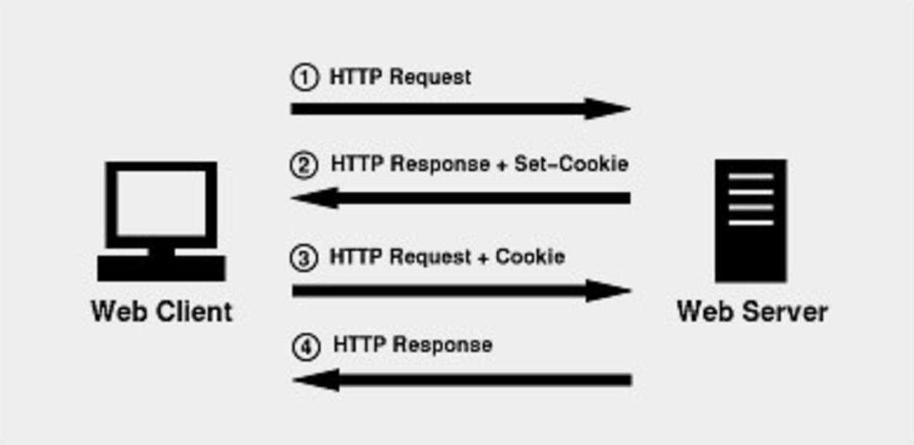
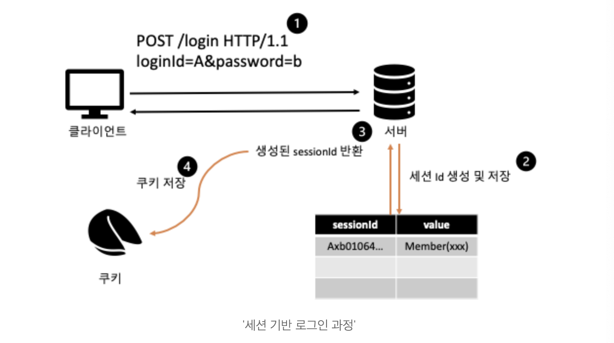
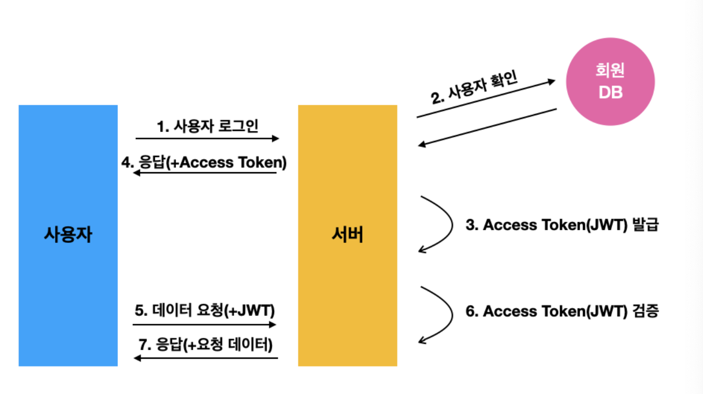
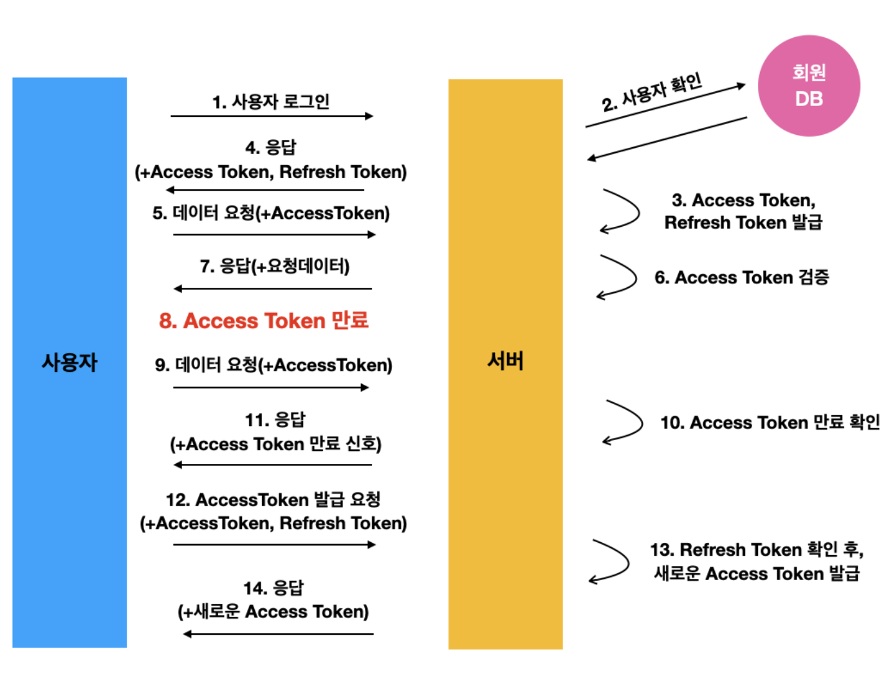

# TL;DR

아래 4개는 웹의 대표적인 저장소이다.  

- 쿠키 : HTTP의 `비연결성(Connectionless)`과 `비상태성(Stateless)` 특성을 보완하기 위한 방법
  - 웹 사이트에 접속할 때 **서버에서 생성**하여 **사용자 브라우저에 정보를 담는 임시 파일**
- 세션 : 쿠키의 트래픽 문제와 보안 이슈를 해결하기 위해 등장
  - 정보(세션 id 등)를 서버에 저장하고, 브라우저를 닫을 때 소멸
- JWT : 인증에 필요한 정보들을 암호화시킨 토큰
  - 보안 문제로 Access Token과 Refresh Token 사용
  - 성능과 사용 편의성 그리고 보안성을 적절히 타협한 방식
- 웹 캐시 : 리소스 파일의 임시 저장소
  - 같은 자원을 사용할 때 일일이 불러오지 않고 캐시되어 있는 자원을 사용하여 **전송량은 줄이고 속도는 높이는 방법**

 

#### 쿠키와 세션의 차이

- **저장 위치**

  쿠키는 클라이언트에 메모리 또는 파일에 저장하고, 세션은 서버 메모리에 저장된다.

- **보안**

  쿠키는 클라이언트 로컬에 저장되기도 하고 특히 파일로 저장되는 경우 탈취, 변조될 위험이 있어 보안이 비교적 취약하다. 반대로 세션은 정보 자체는 서버에 저장되어 있으므로 비교적 안전하다.

- **라이프 사이클**

  Permanent 쿠키의 경우 브라우저를 종료하더라도 저장될 수 있지만, 세션은 서버에서 지워버릴 수 있기도 하고 세션 쿠키에서 세션 아이디를 저장한 경우 브라우저 종료시 정보가 날아간다.

- **속도**

  쿠키 사용시 서버는 요청 헤더를 바로 참조하면 되므로 속도에 유리하지만, 세션은 받은 세션 아이디를 이용해 다시 데이터를 참조해야하므로 속도가 비교적 느릴 수 있다.

 

#### JWT를 사용하는 이유

- 서버 인프라를 확장해야 되서 여러 개의 서버를 사용해 로드 밸런싱을 수행하는 경우 문제 발생

  서버1과 세션을 만든 클라이언트의 세션ID는 서버1에 저장되지만 서버2는 알지 못하기 때문

- 따라서 주어진 요처을 허용하거나 거부하는데 필요한 모든 정보가 포함된 `토큰`을 사용해 서버는 검증만 하는 방식을 사용한다.

 

#### 웹 캐시를 사용하는 이유

- 캐싱은 기본적으로 처리 속도를 높이기 위해 사용된다.
- 웹 캐시는 서버의 정적 컨텐츠(이미지, JS, CSS 등)를 저장해 웹 사이트 서버에 해당 컨텐츠를 매번 요청해서 받지 않음으로 사이트 응답 시간을 줄이기 위한 방법이다.

   

# 들어가기 전에

HTTP 통신은 다음과 같은 특징을 가진다.

- 대부분의 파일 형식 전송 가능
- 클라이언트 - 서버 구조
- `비상태성 Stateless` : 서버는 클라이언트의 상태를 저장하지 않는다.
- `비연결성 Connectionless` : 연결을 유지하지 않는 것을 기본 동작으로 갖는다.

 

실제로는 데이터 유지가 필요한 경우가 많다. 정보를 유지하지 않으면 페이지를 이동할 때마다 로그인을 다시하거나, 상품을 선택했는데 구매 페이지에 상품 정보가 없거나 하는 일이 발생할 수 있기 때문이다. 

이에 따라 상태값을 저장할 수 있는 수단이 필요하게 됐다. 클라이언트에 정보를 파일로 남기는 것을 `쿠키`라고 하고 서버에서 별도로 저장하는 것을 `세션`이라고 한다.

  

# 쿠키, 세션, JWT, 캐시

- HTTP 프로토콜의 `비연결성(Connectionless)`과 `비상태성(Stateless)` 특성을 보완하기 위한 방법
- 로그인, 접속시간, 장바구니 등 다양한 **사용자 정보를 관리**하여 웹사이트에서 사용자 경험을 더욱 편하게 만들어 준다.

  

## 쿠키

- 웹 사이트에 접속할 때 **서버에서 생성**하여 **사용자 브라우저에 정보를 담는 임시 파일**이다.
- 제한적이지만 브라우저와 서버 간 지속적으로 유지할 수 있는 데이터를 제공한다.

- 쿠키의 데이터 형태는 Key와 Value로 구성되고 String 형태로 이루어져 있다. 크기는 4KB를 넘을 수 없다.

 

> ☝️ 여기서 잠깐!
>
> 웹 브라우저 쿠키의 최대는 왜 4KB 일까?
>
> encodeURIComponet() 로 인코딩한 이후의 name=value 쌍은 4KB를 넘을 수 없기 때문이다.
>
> 또한 서버 도메인 하나당 저장할 수 있는 쿠키의 수는 20여개 정도로 한정되어 있다. (브라우저마다 상이)

 

#### 구성요소

- Name : 쿠키의 이름
- Value : 쿠키의 저장된 값
- Option : 쿠키의 속성
  - Expires : 쿠키 만료일
  - Domain : 쿠키가 사용되는 도메인
  - Path : 쿠키를 반환할 경로
  - Secure : 보안 연결 설정
  - HTTPOnly : HTTPOnly 설정시 쿠키는 서버에 전송하는 용도로만 사용가능
  - SameSite : XSRF 공격을 방어하기 위한 속성

 

#### 목적

- **세션 관리(Session Management)**

  로그인, 사용자 닉네임, 접속 시간, 장바구니 등 서버가 알아야할 정보를 저장

- **개인화(Personalization)**

  사용자마다 다르게 그 사람에 적절한 페이지를 보여줄 수 있음

- **트래킹(Tracking)**

  사용자의 행동과 패턴을 분석하고 기록

  

### 동작 과정

1. 클라이언트가 서버에 요청
2. 서버는 HTTP 응답 헤더에 `set-cookie 속성`을 추가하여 응답 →  클라이언트는 쿠키 저장
3. 클라이언트는 이후 서버에 요청할 때 전달받은 쿠키를 자동으로 요청 헤더에 추가하여 요청(브라우저가 자동으로 추가)
4. 서버에서 쿠키를 참고하여 로직 수행

 

#### 쿠키 사용 예시

- 아이디 저장, 로그인 상태 유지
- 일주일간 다시 보지 않기
- 쇼핑몰 장바구니 기능
- 최근 검색한 상품을 광고에서 추천

  

### 쿠키의 종류

- `Session 쿠키` : 웹 브라우저가 종료될 때 제거되는 쿠키

- `Permanent 쿠키` : 브라우저가 종료돼도 유지되는 쿠키 (`Expires` 또는 `Max-Age` 옵션으로 쿠키가 얼마나 유지될지 정해줌)

- `Secure 쿠키` : HTTPS 프로토콜에서만 사용, 쿠키 정보가 암호화 되어 전송됨 **(쿠키 탈취문제 예방)**

- `Third-Party 쿠키` : 사용자가 방문한 웹 사이트에서 발행한 쿠키가 아니라, 다른 웹 사이트에서 발행한 쿠키

  - 다른 사이트의 사용내역에 대한 정보를 쿠키로부터 가져와 활용할 수 있어 사용자의 온라인상 행동을 추적 및 데이터를 분석해 광고 등에 사용할 수 있다.

  - 방문한 도메인과 다른 도메인의 쿠키 보통 광고 베너 등을 관리할 때 유입 경로를 추적하기 위해 사용

  - `ads.com` 스크립트가 심어져 있는` amazon.com` 에서 A 상품을 보면 `ads.com` 은 사용자가 `amazon.com`에서 A 상품을 봤다는 정보를 담아 쿠키를 발행,

    사용자가 `cupang.com` 사이트에 방문했을 때 `cupang.com` 에 `ads.com` 스크립트가 심어져 있다면 `amazon.com` 에서 A 상품 봤다는 것을 쿠키 정보로 광고를 보여줄 수 있다.
  
  > ☝️ 여기서 잠깐!
  >
  > 구글 크롬에서 2023년까지 서드파티 쿠키 지원을 중단하고 FLoC 기술로 대체한다고 발표한 바 있음. 그러나 서드파티 쿠키의 문제점을 해결한 기술이 전혀 아니라는 의견이 있음.
  >
  > [- 서드파티 쿠키 대신 플록 제안한 구글, 사실은 덫을 놓았나?](https://www.boannews.com/media/view.asp?idx=95418)

  

### 단점

- 쿠키에 대한 매 정보를 헤더가 추가해서 보내기 때문에 **추가적인 트래픽** 발생

- 불안 요소가 많고 **해킹의 위험**도 높다.

  -> 따라서 조작되거나 가로채여도 큰 일은 없을 수준의 정보들을 저장

  

### 보안 옵션

#### Secure

- HTTPS 프로토콜에서만 쿠키를 전송(쿠키 탈취문제 예방)
- 그래도 민감한 정보는 담지 않는 것이 좋다.

 

#### HttpOnly

- Cross Site Scripting(XSS) 공격 방지

- 브라우저에서 쿠키 접근 불가

- HttpOnly 속성 정의된 쿠키는 서버에 전송하는 용도로만 사용할 수 있다.

  -> HttpOnly가 설정된 쿠키는 HTTP 통신 상에서만 사용되어아 하기 때문에, 자바스크립트 같은 외부 프로그램은 접근할 수 없다.

- 그러나 최근 웹 페이지들은 SPA로 구현되어지고 AJAX를 통해 서버와 통신하는데, HttpOnly 옵션을 가진 쿠키는 JavaScript를 통해 접근하지 못해 쿠키 값을 서버에 전송할 수 없다.

 

#### SameSite

- XSRF 공격을 방어하기 위한 속성
- Cross-Site 요청에 쿠키를 포함할지 포함하지 않을지 결정하는 쿠키 보안 속성

- `None` : SmaeSite 속성이 등장하기 전 동작하던 쿠키 방식
  - 쿠키는 크로스 사이트 요청에도 항상 전송됨
- `Lax` : 웹 페이지 이동과 안전한 HTTP 메서드 요청의 경우 쿠키를 전송
  - `<a href>`, `<link href>` ,` <form method=get>`에서는 쿠키 전송
- `Static` : 모든 크로스 사이트 요청에 쿠키를 전송하지 않음

 

> ☝️여기서 잠깐!
>
> XSS (Cross Site Scripting) : 공격자가 웹 사이트에 악성 스크립트를 주입해 사용자 브라우저에서 악성 스크립트를 실행시키는 공격
>
> XSRF (Cross Site Request Forgery) : 사용자가 자신의 의지와 무관하게 공격자가 의도한 행위(수정, 삭제 등)를 특정 웹사이트에 요청하게 하는 공격

   

## 세션

- 쿠키의 트래픽 문제와 보안 이슈를 해결하기 위해 등장
- 사용자가 브라우저를 통해 웹 서버에 접속한 시점부터 종료하는 시점까지 일련의 요청들을 하나의 상태로 보고 그 상태를 일정하게 유지시키는 기술 **(논리적인 연결)**
- 정보를 서버에 저장하고, 브라우저를 닫을 때 소멸
- 세션 ID로 클라이언트를 구분해, 클라이언트 요구에 맞는 서비스를 제공
- 보안 면에서 쿠키보다 우수하지만 사용자가 많아질 수록 서버 메모리를 많이 차지하게 됨

 

### 동작 과정

1. 클라이언트가 서버에 처음으로 요청을 보냄 (처음이라 `session id`가 존재하지 않음)
2. 서버에서 `session id`를 발급하여 응답
3. 클라이언트가 전달 받은 `session id`를 쿠키로 저장
4. 클라이언트는 매 요청마다 헤더 쿠키에 넣어 요청
5. 서버는 `session id`를 통해 사용자를 식별하고 클라이언트 상태 정보를 유지하며 응답
6. 클라이언트 종료 시 `session id` 제거, 서버에서도 제거

 

> ☝️ 여기서 잠깐!
>
> 만약 클라이언트가 로그인을 성공하면 서버는 `새로운 session id`(로그인을 인증받은)를 발급한다. 클라이언트도 `새로 발급 받은(로그인 인증 받은) session id`와 함께 요청하게 된다.

 

#### 세션 사용 예시

- 로그인 같이 보안에 필요한 작업에 사용

- 한 페이지 내에서 로그인하고 다른 페이지를 왔다 갔다 할 때도 로그인 정보 유지

  

### 세션의 단점

- 서버에 데이터를 저장하기 때문에 양이 많아질수록 부하가 커지고 저장 공간 부족 문제 발생

  -> 동시접속자 수가 많은 웹 사이트의 경우 서버에 과부화를 주게 되어 성능 저하의 요인이 됨

- 쿠키에 정보가 있으면 헤더를 바로 참조하면 되지만, 세션은 세션 아이디를 이용해 서버에서 데이터를 참조해야 하므로 속도가 비교적 느릴 수 있다.

- session id 또한 탈취되면 보안 상 문제 발생

 

#### 해결 방법

- HTTPS 사용해 서버와 클라이언트 간의 주고받는 정보를 암호화해 요청을 탈취하더라도 읽지 못하게 하기
- 세션에 유효시간을 지정하기 (일정 시간 지나면 해당 클라이언트와 서버의 세션 끊기)

   

## JWT (JSON Web Token)

- 인증에 필요한 정보들을 암호화시킨 토큰
- `Token` : 인증을 위해 사용되는 암호화된 문자열
- 서버는 토큰이 유효한지만 확인하면 되고 별도의 저장소가 필요없어 세션 인증에 비해 **서버 운영의 효율이 더 좋다.**
- 토큰 기반으로 하는 다른 인증 시스템(구글, 페이스북 로그인)에 접근이 가능해 확장성이 뛰어나다.
- C, Python, Java, JavaScript 등 대부분의 프로그래밍 언어에서 지원되어 범용성이 좋다.

 

#### 구성요소

- **Header(헤더)**

  토큰의 타입과 해싱할 알고리즘 방식(일종의 metadata 정보)

- **Payload(정보)**

  토큰에 담을 정보 (일반적으로 유저의 고유 ID값과 유효기간)

- **Verify Signature(서명)**

  - Base64 방식으로 인코딩한 `Header`  `Payload`  `SECRET KEY` 를 더한 후 서명
  
   
  
  > ☝️ 여기서 잠깐!
  >
  > Verify Signature를 사용하는 이유는?
  >
  > Verify Signature는 `SECRET KEY`를 알지 못하면 복호화 할 수 없다. 
  >
  > 만약 누군가가 A의 토큰을 조작해 데이터를 훔치려고 할 때, A 토큰의 ID를 자신의 ID로 바꿔서 서버에 보내야 한다. 그런데 이때 서버는 암호화된 Verify Signature를 검사해서 정보가 바뀐 토큰을 유효하지 않은 토큰으로 간주하게 된다.
  >
  > 즉, SECRET KEY를 알지 못하는 이상 토큰을 조작할 수 없다는 것이다.

  

### 토큰 전달과 저장 방법

#### 로그인 시

1. 브라우저에서 사용자가 로그인하면 서버에 이메일과 비밀번호를 전송

2. 서버에서 이메일과 비밀번호를 확인 후 사용자가 확인되면` JWT`를 생성

   (사용자 고유 ID값을 부여하고, 기타 정보와 함께 Payload에 넣음)

3. `JWT`의 유효기간을 설정하고, `SECRET KEY` 이용해 Access Token 발급

4. 사용자는 Access Token을 받아 쿠키에 저장

5. 인증이 필요한 요청마다 토큰을 헤더에 실어 보냄

6. 서버에서 해당 토큰의 Signature를 `SECRET KEY`로 복호화한 후, 조작 여부와 유효 기간을 확인

7. 해당 토큰 검증이 완료되면 Payload를 디코딩하고 해석한 정보에 따라 응답

  

### 단점

- 이미 발급된 JWT에 대해서는 돌이킬 수 없다.

  세션/쿠키의 경우 쿠키가 악의적으로 이용되면 해당 세션을 지워버리면 된다. 하지만 JWT는 한 번 발급되면 유효기간이 완료될 때까지 계속 사용이 가능하다.

- Payload 정보가 제한적이다.

  Payload는 따로 암호화되지 않아 디코딩하면 누구나 정보를 확인할 수 있기 때문에, 중요한 정보는 넣을 수 없다.

- JWT 길이가 쿠키와 세션에 비해 길다.

  인증에 필요한 요청이 많아질 수록 서버 자원 낭비가 발생한다.

 

### 해결 방법 - Refresh Token

- JWT(Access Token)의 경우 보안을 위해 유효 기간을 짧게 세팅한다. 그러나 이러면 사용자가 새 토큰을 발급받기 위해 로그인을 자주 시도해야 한다.
- 처음 인증을 완료했을 때 유효기간이 짧은 Access Token과 유효기간이 긴(보통 2주) Refresh Token을 동시에 발급하고, Access Token이 만료되면 Refresh Token을 통해 새로 토큰을 발급 받는다.
- 여전히 Access Token을 탈취 당하면 정보가 유출되는건 동일하지만, 유효기간이 짧아 조금 더 안전하게 하자는 의미 + 서버는 Refresh Token을 삭제함으로 강제 로그아웃 시킬 수 있음
- 하지만 검증 프로세스가 길어져 구현이 복잡하고, Access Token 만료될 때 마다 새로 발급하는 과정에서 HTTP 요청 횟수가 많아 서버 자원 낭비로 이어질 수 있다.

8. 시간이 흘러 `Access Token`이 만료

9. 사용자는 만료된 `Access Token`을 헤더에 실어 요청을 보낸다.

10. 서버는 `Access Token`이 만료됨을 확인

11. 만료된 토큰임을 알리고 권한없음을 신호로 보낸다.

    > ☝️ 여기서 잠깐!
    >
    > Access Token이 만료될때 마다 9~11 과정을 거칠 필요는 없다. 
    >
    > Access Token의  Payload를 통해 유효기간을 알수 있다. 
    >
    > 따라서 프론트엔드 단에서 API 요청 전에 토큰이 만료 됐다면 바로 재발급 요청 가능.

12. 사용자는 `Refresh Token`과 `Access Token`을 함께 서버로 보낸다.

13. 서버는 받은 `Access Token`이 조작되지 않았는지 확인한후, `Refresh Token`과 사용자의 DB에 저장되어 있던 `Refresh Token`을 비교한다.

14. 서버는 Token이 동일하고 유효기간도 지나지 않았다면 `새로운 Access Token`을 사용자에게 보내준다.

15. `새로운 Access Token`을 헤더에 실어 API 요청

 

#### 사용 예시

- 일정 시간이 지나면 자동으로 로그아웃되는 기능
- 최초 로그인한 ip와 다른 ip에서 로그인 요청이 왔을 때 강제 로그아웃 기능 (Refresh 삭제하기)

   

## 캐시

- 리소스 파일들의 임시 저장소

  (자주 사용되는 이미지나 html, css, js 파일 등을 브라우저에 저장해놓고 사용)

- 같은 자원을 사용할 때 일일이 불러오지 않고 캐시되어 있는 자원을 사용하여 **전송량은 줄이고 속도는 높이는 방법**

- 캐시에 있는 것을 재사용하기 때문에 경우에 따라 **변경된 자원을 참조할 수 없는 경우가 생김**

  -> 사용자가 브라우저 캐시를 지워주거나, 서버에서 클라이언트로 응답 보낼 때 헤더에 자원 캐시 만료기간을 명시하는 방법 등을 이용해 회피할 수 있다.

- 사용자가 수동으로 삭제해줘야 한다.

 

####  Content Delivery Network (CDN) 

- 지리적으로 분산된 여러 개의 서버를 이용해 웹 콘텐츠를 사용자와 가까운 서버에 전송함으로 전송 속도를 높이는 방법
- 각 지역에 캐시 서버(PoP, Points of presence)를 분산 배치해 근접 사용자의 요청에 본 서버가 아닌 캐시 서버가 콘텐츠를 전달한다.
- 서버와 사용자의 물리적 거리를 줄여 콘텐츠 로딩에 소요되는 시간을 최소화한다.
- 치킨 체인점이 전국 주문을 본사에서 전부 처리하지 않고 각지의 체인점에서 받는 것처럼, CDN은 여러 지역에 설치된 캐시 서버를 사용해 본 서버로 들어오는 요청을 분산 처리하는 서비스다.

   

# 추가 내용

### 브라우저 저장소

브라우저에서 지원하는 저장소는 쿠키 외에도 `로컬 스토리지(Local Storage)`와 `세션 스토리지(Session Storage)`가 있다.

- HTML5에 추가된 key-value 스토리지로, 클라이언트에 대한 정보를 로컬에 저장.
- 로컬 스토리지 : 유효 기간이 없고 영구적으로 이용 가능
- 세션 스토리지 : 세션 종료 시(브라우저 닫을 시) 데이터가 삭제됨

 

#### 장점

- 5MB까지 사용 가능
- 쿠키와 다르게 웹 스토리지는 네트워크 요청 시 서버로 전송되지 않아 쿠키보다 더 많은 자료를 보관할 수 있다.

 

#### 단점

- HTTP5 지원하지 않는 브라우저는 사용 불가
- XSS(Cross Site Scripting)공격에 취약, 그러나 CSRF 공격엔 더 안전

  

### XSRF (Cross Site Request Forgery) 공격

- 사용자가 자신의 의지와 무관하게 공격자가 의도한 행위(수정, 삭제 등)를 특정 웹사이트에 요청하게 하는 공격
- 특정 웹 사이트가 사용자의 웹 브라우저를 신뢰하는 상태를 노린 공격
- 사용자가 웹 사이트에 로그인한 상태에서 XSRF 공격 코드가 삽입된 페이지를 열면, 공격 대상이 되는 웹사이트는 위조된 공격 명령이 믿을 수 있는 사용자로부터 발송된 것으로 판단하게 되어 공격에 노출된다.
- 예를 들어, 페이스북에 희생자의 계정으로 광고성 글을 올리거나, 희생자가 피싱 사이트에 접속하도록 하는 것

 

#### 대응 방법

- 피싱 페이지에서 호출한 백엔드 API가 실패되도록 해야 한다.
- 백엔드 API가 정상적으로 응답해야 하는지 판단해야 하기 때문에 백엔드 측에서 대응해줘야 한다.

1. 쿠키의 SameSite 사용
   - SameSite 속성 값으로 `Lax`, `Strict` 사용하면 쿠키를 동일한 사이트에서만 전달 할 수 있게 할 수 있다.
   - 구형 브라우저에서는 SameSite 속성을 지원하지 않아 한계가 있다.
2. Referer 체크
   - Request 헤더의 Referer을 확인해 유효한 사이트에서 API를 호출하는지 확인하는 방법
   - Same-Origin Policy(SOP)를 지키면 XSRF 공격을 방어할 수 있지만, 다른 출처의 자원을 사용해야 하는 경우가 있어 CORS를 허용해주는 경우가 많다.
   - 이 경우 CORS를 위해 모든 출처를 허용하지 않고 유효한 출처만 허용하는 것이 좋다.
3. Security Token 사용
   - 사용자 인증 절차를 좀 더 복잡하게 만들어 XSRF 공격 막기
   - 임의의 토큰을 발급해 서버의 세션에 토큰을 저장하고, 그 토큰을 프론트 엔드로 전달
   - 프론트엔드에서는 API를 호출할 대 전달 받은 토큰을 함께 전달하고, 서버에서 세션에 저장된 토큰과 프론트엔드에서 전달 받은 토큰을 비교해 동일할 경우 API를 실행하는 방식

  

### XSS (Cross Site Scripting) 공격

- 공격자가 웹 사이트에 악성 스크립트를 주입해 사용자 브라우저에서 악성 스크립트를 실행시키는 공격
- 웹 사이트 관리자가 아닌 다른 사람이 웹 페이지에 악성 스크립트를 삽입할 수 있는 점을 노린 공격

 

#### 비 지속적(Non-persistent) 공격 방법

- Reflected XSS

- 포탈 사이트에서 문자열을 검색할 때, 일반적으로 검색 결과 페이지에서 검색한 문자열을 그대로 다시 표시한다.
- 검색한 문자열에 스크립트가 포함되어 그 스크립트가 실행된다면 비 지속적 XSS 공격에 취약점을 가지고 있는 것이다.

 

#### 지속적(Persistent) 공격 방법

- 비 지속적 공격 방법보다 치명적인 공격 방법
- 공격자가 게시판에 글쓰기를 통해 스크립트를 포함한 게시글을 작성한 후 서버에 저장,
- 다른 사용자가 게시글 읽을 때 게시글에 포함된 스크립트가 실행되면서 XSS 공격이 성공하게 됨
- 게시글을 읽는 사용자의 개인정보를 공격자에게 전송시키는 스크립트가 포함되어 있다고 한다면, 게시글을 읽는 모든 사람의 개인 정보가 유출되는 것이다.
- 사용자의 정보(쿠키, 세션 등)를 탈취하거나 비정상적인 기능(게시글 삭제, 수정 등)을 수행하게 할 수 있다.

 

#### 대응 방법

- XSS 공격은 보통 프론트 엔드 측에서 대응해준다.
- 페이지에서 공격자가 입력한 스크립트를 실행하지 못하게 해야 한다.
  1. 스크립트 입력을 막거나, 
     - 스크립트를 입력하지 못하도록 막는다. (`<script>` 태그 방지)
     - 그러나 다른 방식(이벤트 핸들러 등)로도 스크립트를 실행할 수 있어 모든 케이스에 대응해 입력 값을 제한하는 것은 쉽지 않다.
  2. 브라우저가 스크립트를 실행하지 못하도록 스크립트 값을 변경해야 한다.
     - HTML 태그에 사용되는 `<` `>` 문자열을 인코딩한 것을 저장해 브라우저가 일반 문자열로 인식해 스크립트가 실행되지 않도록 하는 방법

   

# References

- [HTTP의 특징](https://kotlinworld.com/97)
- [쿠키, 세션, JWT, 캐시](https://github.com/workhardslave/cs-study/blob/main/Network/Cookie_Session_JWT_Cache.md)
- [Javascript Cookie 쿠키 저장, 가져오기, 삭제 함수](https://wildeveloperetrain.tistory.com/146)

- [쿠키, 세션 그림](https://nesoy.github.io/articles/2017-03/Session-Cookie)

- [쿠키 보안 속성](https://beomy.github.io/tech/browser/cookie/)
- [쿠키, 세션, 로컬 스토리지와 세션 스토리지](https://racoonlotty.tistory.com/entry/%EC%BF%A0%ED%82%A4%EC%99%80-%EC%84%B8%EC%85%98-%EA%B7%B8%EB%A6%AC%EA%B3%A0-%EB%A1%9C%EC%BB%AC-%EC%8A%A4%ED%86%A0%EB%A6%AC%EC%A7%80%EC%99%80-%EC%84%B8%EC%85%98-%EC%8A%A4%ED%86%A0%EB%A6%AC%EC%A7%80)

- [쿠키와 세션 로그인 처리](https://itstory1592.tistory.com/62)
- [쿠키, 세션, 캐시의 차이점](https://jeong-pro.tistory.com/80)
- [XSS, XSRF](https://beomy.github.io/tech/etc/xss-xsrf/)

- [서드파티 쿠키](https://blog.rs-team.com/12)

- [서버 인증 방식(세션/쿠키, 토큰)](https://velog.io/@kingth/%EC%84%9C%EB%B2%84-%EC%9D%B8%EC%A6%9D-%EB%B0%A9%EC%8B%9D%EC%84%B8%EC%85%98%EC%BF%A0%ED%82%A4-%ED%86%A0%ED%81%B0)

- [Refresh Token](https://tecoble.techcourse.co.kr/post/2021-10-20-refresh-token/)

- [Refresh Token이 필요한 이유는? 보안 관점](https://okky.kr/articles/1007579)

- [서버 구현 시리즈](https://velog.io/@tlatldms/%EC%84%9C%EB%B2%84%EA%B0%9C%EB%B0%9C%EC%BA%A0%ED%94%84-Refresh-JWT-%EA%B5%AC%ED%98%84#%EB%A1%9C%EA%B7%B8%EC%95%84%EC%9B%83-%EC%A0%95%EC%B1%85)