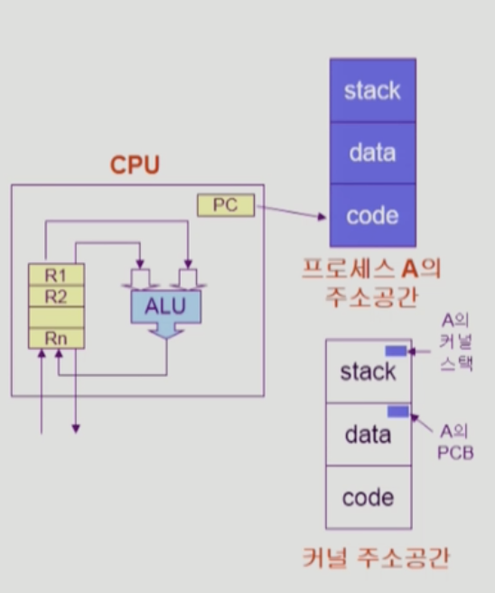
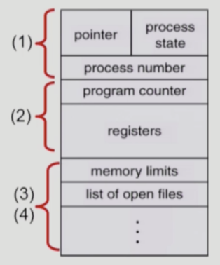
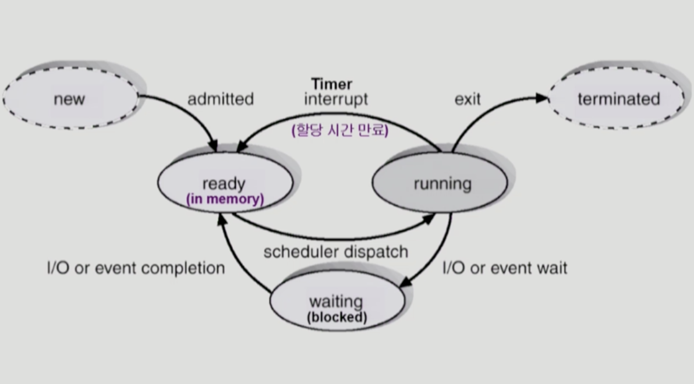
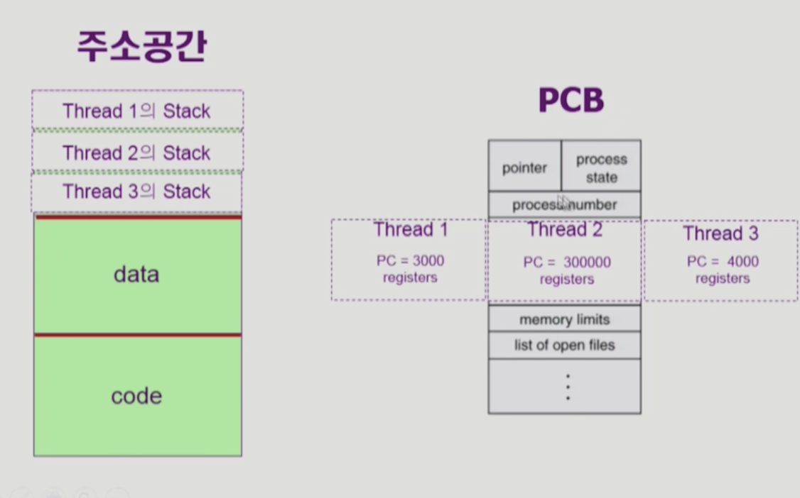
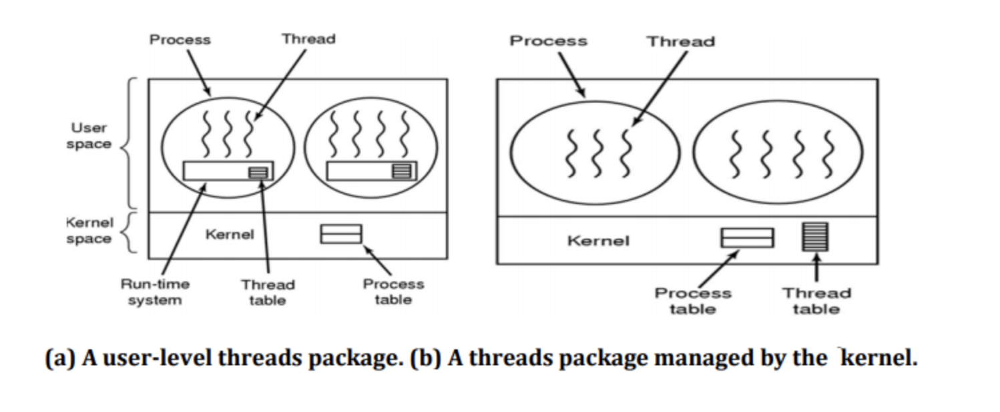
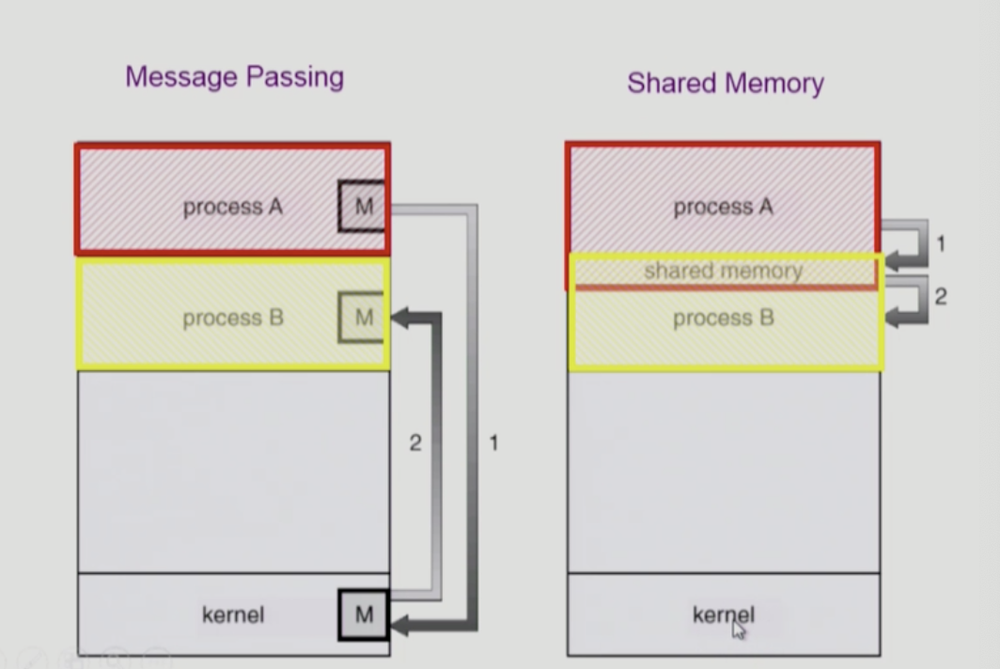

# TL;DR

운영체제란 HW를 효율적으로 관리하는 소프트웨어로, 시스템 입장에서는 자원 할당자다. 

  컴퓨터 발전 과정에서 

1. 여러 개의 프로그램을 메모리에 올려둘 수 있게 됐고 (bigger and cheaper memory 발전),

2. User interactive 환경이 대두되면서(모니터/키보드 등), I/O bounded job 이 많아졌다.   

   

CPU를 더욱 효율적으로 사용하기 위한 방법이 모색됐고, 이를 CPU Scheduling 이라고 한다.  운영체제는 kernel data 영역에 각 프로세스를 관리하기 위한 정보인 PCB를 가지고, 
Scheduling Algorithm에 따라 CPU를 프로세스에 할당한다.  

이 과정에서 process state, process context, context switch 등의 개념이 나온다.  

Thread는 프로세스 내부에서 CPU를 수행하는 단위로, 동일한 프로세스를 여러개 실행해야할 때, 
주소 공간을 공유해 메모리 낭비를 막고 프로세스를 효율적으로 수행하게 하기 위한 기법이다.

# Process

Process 란 실행 중인 프로그램으로 job, task, sequential process 라고도 불린다.

> ☝️ 여기서 잠깐.   **Program** 은 **파일 시스템 내 실행 파일**을 의미하고,  **Process**는 program이 진행되며 바뀌는  
> **register, memory 영역 등을 모두 포함한 개념**이다.

  

## Process Context

프로그램이 어떤 것을 실행했고, 현재 어느 시점에 있는지 정확하게 규명하기 위한 모든 요소 집합.
 

  위 그림과 같이 크게 세 가지 파트로 나눌 수 있다.

- **CPU 수행 상태를 나타내는 하드웨어 문맥**
    : 현재 시점에 어디까지 실행 됐는가를 확인하는 지표들
    Program Counter(PC), 각종 register
   

- **프로세스의 주소 공간**
    : 현재 시점에 메모리에 어떤 내용이 들어가 있는가를 확인하는 지표들
    Code, Data, Stack
   

- **커널의 주소 공간**
    : 운영체제가 현 프로세스를 어떻게 평가하고 있느냐를 확인하는 지표들
    

  

  
<b>Process Control Block(PCB)</b>

  
       

    
      운영체제가 각 프로세스를 관리하기 위해 프로세스 당 유지하는 정보로, kernel data영역에 있다.  

      1. OS가 관리상 사용하는 정보
           : process state, process ID, scheduler information, priority 등  

      2. CPU 수행 관련 하드웨어 값
           : program counter, registers  

      3. 메모리 관련 위치 정보
           : code, data, stack 위치 정보  

      4. 파일 관련 정보
          open file descriptors 등  

  

  

   

> ❓ Code / Data / Stack 에는 어떤 정보가 저장되나요?  
>
> #### 프로세스의 메모리 영역
>
> - Code 영역 : 프로그램의 코드가 CPU에서 수행 가능한 기계어 형태로 변환되어 저장
> - Data 영역 : 프로그램이 사용하는 데이터를 저장 (전역 변수, static 변수 등)
> - Stack 영역 : 프로그램 내 함수 수행 마치고 복귀할 주소 및 데이터들(지역변수, 매개변수, 리턴값 등)을 "임시로" 저장   
>
> 
>
> #### Kernel의 메모리 영역
>
> - Code 영역 : System call, interrupt 처리 코드 / CPU, 메모리 등 자원 관리를 위한 코드 등 저장
> - Data 영역 : PCB(프로세스 관리를 위한 자료구조), 하드웨어 자원을 관리하기 위한 자료구조 저장
> - Stack 영역 : 각 프로세스들의 커널 스택 (프로그램 함수 수행 마치고 복귀 하듯이, 커널 내 어디로 복귀해야 하는지 프로세스 별로 관리)

  

## Process State

프로세스는 상태(State)가 변경되며 수행된다.
 

1. New : 프로세스 생성

       

프로세스 생성은 다음과 같은 네 가지 경우에서 일어난다.

1. System initialization
2. 실행 중인 프로세스가 프로세스 생성 시스템 호출 (fork)
3. 사용자가 새로운 프로세스 생성하도록 요청
4. 배치 작업의 시작

> Unix 에서는 fork 시스템 콜을 통해 프로세스를 생성한다.
>   fork를 통해 부모 프로세스의 주소 공간을 복사한 후, exec을 통해 새로운 프로그램을 실행시킨다.
>   그러나 리눅스와 같은 운영체제에서는 바로 주소 공간을 복사하지 않고, 
> 우선 실행하다가 부모 프로세스와 자식 프로세스의 내용이 달리지는 순간 카피해서 주소 공간을 할당한다.
>   이 방식을 copy-on-wirte (COW) 라고 부른다.

2. Running : CPU 잡고 instruction 수행 중

       

- running -> waiting(blocked) : I/O 등 오래 걸리는 작업 때문에 자진해서 CPU를 내놓는 경우
- running -> ready : timer interrupt 걸려 CPU 빼앗김

3. Ready : CPU 기다리는 상태 (메모리 등 다른 조건을 모두 만족하고)

       

스케줄러에 의해 CPU 할당 받으면 당장 instruction을 수행할 수 있는 상태

4. Waiting(Blocked) : CPU 주어져도 당장 instruction 수행할 수 없는 상태

       

blocked -> ready : Process 자신이 요청한 event(예: I/O)가 만족될 때 상태 변화

5. Terminated : 프로세스 종료 

       

프로세스 종료는 다음과 같은 두 가지로 일어난다.

1. 자발적 종료

  - (main 끝나서 return 한다던가)
  - exit 시스템 콜 수행

2. 비 자발적 종료
   - Fatal Error 로 인한 강제 종료 (segment fault, nonexistent memory 등..)
   - 다른 프로세스에 의한 종료 (kiil)

> ☝️ 여기서 잠깐.
>   프로세스의 세계는 자식 프로세스가 먼저 종료되어야 부모 프로세스가 종료되는, 단계적 종료가 일어난다.
>   따라서 자식이 종료될 때는 부모 프로세스에 알린다.

 

# Thread

프로세스 내부에 CPU를 수행하는 단위로, lightweight process라고 부른다.
  동일한 일을 하는 프로세스를 여러 개 실행할 때, 프로세스를 여러 개 만들면 주소공간이 낭비되기 때문에 
주소 공간을 하나만 두고(공유할 수 있는 자원은 공유) 실행하는 방식이다.

 

  **[ 장점 ]**

- CPU 관련 정보들 (PC, registers)만 Thread 별로 가지고 있기 때문에, 메모리가 절약된다.
- Creating & Switching 모든 면에서 프로세스보다 Thread가 빠르고 오버헤드도 적다.
- CPU가 여러개인 컴퓨터에서는 Thread를 활용해 병렬성을 높일 수 있다.
    

## Thread 구현

 

### a. User Threads

커널이 Thread 의 존재를 알지 못하며, 사용자 공간에 Thread를 위치시킨다. Thread 관리는 라이브러리로 제공한다. 

- Thread를 지원하지 않는 OS 에서도 구현될 수 있고,

- Thread 생성, 전환 등에 kernel 도움이 필요 없어 10-100배 정도 빠르다. (function call 사용)

- Customized Scheduling Algorithm 사용이 가능하다.

   

- 그러나 OS가 Thread 존재를 모르기 때문에 clock interrupt 를 할 수 없어 무한루프 발생 등 오류 발생 시 thread 스케줄링이 어렵다.

- 하나의 Thread가 오류로 인해 죽거나 block 되는 경우, 전체 Process가 죽거나 block 된다.

 

### b. Kernel Threads

커널이 Thread 의 존재를 알고, 그 관리를 OS가 Thread table을 만들어 한다.

- OS가 Thread를 알기 때문에 스케줄링이 가능하다.
- Thread 생성, 전환 등에 system call 이 사용되므로 오버헤드가 크다.

  

# Scheduler

CPU를 효율적으로 사용하기 위한 방법으로, 어떤 프로세스에게 CPU를 줄 지 고른다.
  CPU Scheduler가 프로세스를 고르면, **Dispatcher**가 CPU제어권을 선택된 프로세스에게 넘긴다.
  이 과정을 **Context Switch**라고 한다.

> ☝️ 여기서 잠깐. 
>   CPU Scheduler는 별도의 하드웨어인가? 아니면 프로그램인가?
>   정답은, 운영체제 안에 스케줄러 코드가 있고 이걸 CPU Scheduler라고 부르는 것 뿐이다.

  **[ Scheduler가 필요한 이유 ]**
  프로그램의 실행은 CPU를 연석적으로 사용하는 단계(CPU burst)와 I/O를 사용하는 단계(I/O burst)로 이루어져 있다.
  Interactive job들은 I/O burst가 잦기 때문에, 사용자가 오래 기다리지 않게 하기 위해 CPU 스케줄링이 꼭 필요하다.

  **[ 언제 Scheduler가 필요한가 ]**

- nonpreemptive (자진 반납)
    예) I/O 시스템콜, Terminate

- preemptive(강제로 빼앗음) 
    예) CPU 할당 시간 만료(timer interrupt)
   

즉, CPU Scheduler 는 CPU를 사용하는 프로세스가 전환되는 것에 관여한다.  

### Context Switch

CPU를 한 프로세스에서 다른 프로세스로 넘겨주는 과정으로, 운영체제는 다음을 수행한다.

- CPU를 사용하던 프로세스 A가 system call 또는 interrupt 발생으로 CPU를 넘겨야 할 때
- CPU를 내어주는 프로세스 A의 상태를 A의 PCB에 기록하고,
- CPU를 새롭게 얻는 프로세스 B의 상태를 B의 PCB에서 읽어온다.

> ☝️ 여기서 잠깐.
>   system call이나 interrupt 발생 시 반드시 context switch가 일어나지는 않는다.
>   system call이나 interrupt 발생 시 프로세스 A에서 운영체제로 CPU가 넘어갔다가, 
> 바로 프로세스 A에게 CPU를 넘겨줄 수도 있다. 이런 경우는 context switch라고 부르지 않는다.
>   context switch는 운영체제가 다른 프로세스로 CPU를 넘길 때만 일어난다.
>  

  

### Scheduler의 종류

#### 장기 스케줄러 Job scheduler

- 시작 프로세스 중 어떤 것을 ready queue에 보낼지 결정한다.
- 즉, 프로세스에게 memory를 주는 문제를 다룬다.
- 메모리에 올라가 있는 프로세스의 수를 제어한다. (Degree of Multiprogramming)

​	-> 사실 지금은 프로세스 시작되면 곧바로 메모리에 올리고, 중기 스케줄러를 통해 프로그램의 수를 제어한다. 

#### 단기 스케줄러 CPU Scheduler

- 어떤 프로세스를 다음에 running 시킬지 결정한다.
- 즉, 프로세스에게 CPU를 주는 문제를 다룬다.
- Millisencond 단위로 이루어진다.  

#### 중기 스케줄러 Swapper

- 여유 공간 마련을 위해 프로세스를 통째로 메모리에서 디스크로 쫓아낸다.
- 즉, 프로세스에게 memory를 빼앗는 문제를 다룬다.

  

### Process state

process state에 suspend(stopped)가 추가된다.
 .png)

> ☝️ 여기서 잠깐. 
>   Blocked : 프로세스 자신이 요청한 event 가 완료되면 Ready 상태가 됨
>   Suspended : 외부(스케줄러)에서 프로세스를 정지해둔 상태로, 외부(스케줄러)에서 Resume 해주어야 Ready 상태가 됨.

> ✌️ 여기서 잠깐. 
>   User mode Running : 프로세스가 CPU 가지고 있으면서 본인의 코드를 실행하는 상태
>   Monitor mode Running : 운영체제에 요청해 운영체제가 실행 중인 상태로, 
> Kernel model 라고 말하지 운영체제가 running 한다고 말하지는 않는다.
>  

 

## Scheduling Algorithm

스케줄링 알고리즘은 어떤 시스템이냐에 따라 다른 목적을 갖게 된다.
  대부분은 CPU의 효율성에 중점이 있으나, 
  interactive system의 경우 응답 속도에, 
  real-time system의 경우 deadline 지키는 것에 중점을 둔다.

#### FCFS(First-Come-First-Service)

- 비선점 스케줄링 알고리즘 (Non-preemptive)

- 먼저 도착한 프로세스를 먼저 처리하는 방식

- 구현하기 쉽지만 효율이 떨어진다.

- 무조건 도착한 순서대로 프로세스를 처리해야 하므로 Convoy Effect가 발생할 수 있음

    : 실행 시간이 긴 프로세스가 실행시간이 짧으 프로세스보다 앞에 있는 경우 기다리는 시간이 길어진다.  

  

#### SJF(Shortest-Job-First)

- 비선점 스케줄링 알고리즘 (Non-preemptive)

- 실행시간(CPU 점유시간)이 짧은 순서대로 프로세스를 처리하는 방식

- 평균 대기 시간을 최소화하고, 많은 프로세스들에게 빠른 응답 시간을 제공할 수 있음

- 그러나 실행시간이 긴 프로세스는 계속 자원 할당을 받지 못해 Starvation(기아 현상)이 발생

- 실제 구현할 때는, CPU 사용시간을 예측하기 어렵다는 점과 모든 Job이 동시에 들어오지 않기 때문에 실제 optional 하게 선택할 수 없다는 점에서 문제가 있다. 

  

#### SRTF(Shortest-Remaining-Time-First)

- 비선점 스케줄링 방식인 SJF를 선점 형태로 변경한 방식 (Preemptive)

- 사전에 실행시간이 알려진다고 할 때, 남은 실행 시간이 짧은 작업을 선택한다.

- 잔여 실행시간을 계속 추적하는 과정에서 Context Switching Overhead가 발생

- 구현 및 사용이 비현실적으로 어려움  

  

#### RR(Round Robin)

- 선점 스케줄링 알고리즘 (Preemptive)
- **자원 사용 제한 시간(Time Quantum)**을 두고 먼저 도착한 순서대로 프로세스를 처리하는 방식
- 프로세스는 할당된 시간이 지나면 자원을 반납해야함 (특정 프로세스의 독점 방지 ⇒ 공정함)
- Time Quantum의 크기 설정이 성능의 중요한 역할을 한다. 시간이 길면 응답의 질이 떨어지고, 시간이 짧으면 문맥 교환으로 인한 오버헤드가 커진다.

 

#### Priority Scheudling

- 우선순위가 가장 높은 프로세스에게 CPU를 할당하는 방식(정수로 표현하고, 작은 숫자가 우선순위가 높음)
- 선점 스케줄링에선 더 높은 우선순위의 프로세스가 도착하면 실행중인 프로세스를 멈추고 CPU 선점
- 비선점 스케줄링에선 더 높은 우선순위의 프로세스가 도착하면 Ready Queue의 Head에 넣음
- 높은 우선순위 프로세스가 CPU를 계속 할당받아 우선순위가 낮은 프로세스는 무한정 연기되는 Starvation(기아 현상) 발생할 수 있다.  

>  아래 두 가지를 질문이 따라온다.
>
> 1. 어떻게 우선순위를 정할 것인지?
> 2. 우선순위가 낮은 프로세스들의 starvation 어떻게 해결할 것인지?

 

#### Muti-level Queue (MLQ)

- 작업별 별도의 Ready Queue를 두어 프로세스를 처리하는 방식 (최초의 배정된 큐를 벗어날 수 없고, 각각의 큐에 자신만의 스케줄링 기법을 사용함)

- 큐 사이에는 우선 순위 기반의 스케줄링을 사용한다.  

- 그러나 여러 개의 큐를 관리해야 하므로 스케줄링 overhead가 발생할 수 있다.

- 우선순위가 낮은 큐는 기아 현상이 발생할 수 있다. 

  -> 이를 해결하기 위해 각 큐에 CPU time을 적절한 비율로 할당할 수 있다.

 

#### Multilevel Feedback Queue

- 프로세스의 큐간 이동이 허용된 MLQ

- 각 큐마다 시간 할당량을 다르게 배정하고, 다른 스케줄링 방식을 사용한다. 
   -> 중요한 프로세스는 타임 퀀텀을 짧게, 덜 중요한건 타임 퀀텀을 길게  

  -> I/O bounded job은 RR 방식을, CPU job은 FCFS 방식을 사용

- I/O-bounded 프로세스들을 상위 단계의 큐로, Compute-bounded 프로세스를 하위 단계의 큐로 이동시켜 우선순위를 높임

- 대기 시간이 지정된 시간을 초과한 프로세스들을 에이징 기법을 통해 상위 단계의 큐로 이동 (Starvation 방지 및 응답 속도 높이기)

   

# 추가 개념 및 용어 정리

### 프로세스와 관련한 시스템 콜

- fork() : create a child (copy)
    부모 프로세스에서 fork()가 발생하면, 자식 프로세스를 만들게 된다.
    fork() 시스템 콜은 부모 프로세스에게 양수를, 자식 프로세스에게는 0을 각각 return 한다.
    자식 프로세스는 fork() 이후의 코드부터 실행한다. 

- exec() : overlay new image
    exec() 실행 이후에는 코드가 남아있더라도 돌아올 수 없다.  

- wait() : sleep until child is done
- exit() : frees all the resoures, notify parent
   

## Interprocess Communication(IPC)

원칙적으로 프로세스는 독립적이라, 하나의 프로세스가 다른 프로세스에 영향을 주지 못한다.
  그러나 협력이 필요한 경우가 있는데 이를 IPC라고 부른다.

 

- Message passing : 커널을 통해 메세지를 보내 통신한다.
- Shared memory : 서로 다른 프로세스가 공유 메모리를 갖는다.
    커널에게 공유 메모리 사용을 요청하고 할당되면 이후 사용한다.
    한 번 공유 메모리가 설정되면 이후는 커널 도움없이 통신이 가능해진다.

> ☝️ 여기서 잠깐.
>   Thread는 사실상 하나의 프로세스이므로 IPC 라고 보기엔 어렵다.
>   그렇지만 동일 프로세스를 구성하는 thread들 간에는 주소 공간을 공유하기 때문에 협력이 가능하다.
>  

### Multiple-processor Scheduling

- Symmetric Multiprocessing (SMP) : 모든 CPU가 대등, 알아서 스케줄링한다,
- Asymmetric Multiprocessing (AMP) : 하나의 CPU가 대장이 되어 스케줄링을 책임진다.
   

### Scheduling Algorithm Evaluation

- Queueing models : 이론적으로 프로세스의 arrive rate과 service rate을 계산
- Implementation & Measurement : 실제 시스템에 알고리즘을 구현하여 성능 측정
- Simulation : 모의 프로그램으로 작성해 trace(예제)를 입력해 결과 비교
    

***

***

# 예상 질문

### 프로세스 VS 스레드

프로세스는 실행 중인 프로그램이고, 스레드는 프로세스 내에서 실행되는 흐름의 단위를 말한다. 

프로세스는 운영체제로부터 자원을 할당받으며 각 프로세스끼리 독립적이다. 반면 스레드는 하나의 프로세스가 할당받은 자원 내에서 Stack 영역만 따로 갖고 나머지는 공유 자원으로 사용한다.  

### 멀티 프로세스 VS 멀티 스레드

멀티 프로세스란 하나의 어플리케이션을 여러 개의 프로세스로 구성해 각 프로세스가 하나의 작업을 처리하도록 하는 것이다.  

멀티 스레드란 하나의 어플리케이션을 여러 개의 스레드로 구성해 하나의 스레드가 하나의 작업을 처리하도록 하는 것이다. 

 

멀티 프로세스를 이용하면 각 프로세스들이 독립적으로 동작하고, 자원이 서로 다르게 할당된다. 따라서 여러 개의 자식 프로세스 중 하나에 문제가 발생 하더라도 다른 프로세스들에 영향이 확산되지 않아 안정성이 좋다. 하지만 Context switching 과정에서의 오버헤드가 크고 프로세스 사이의 통신이 어렵다는 단점이 있다. 

멀티 스레드를 사용하면 프로그램의 일부(하나의 스레드)가 오류 또는 I/O 등의 긴 작업으로 중단되는 상황에서도 프로그램이 계속 수행될 수 있어 응답성이 좋다. 또 스레드는 프로세스의 자원과 메모리를 공유하므로 자원 공유가 쉽고 비용이 덜 든다는 장점이 있다. 하지만 하나의 스레드에 문제가 발생하면 전체 프로세스에 영향을 받고, 스레드 간 자원 공유로 인해 동기화 작업이 필요하다는 단점이 있다.   

### 멀티 스레드를 사용하는 이유는?

시스템 자원을 효율적으로 관리하기 위해 스레드를 사용한다.  

프로그램을 여러 개 실행하는 것보다 하나의 프로그램에서 여러 개의 작업을 하는 것이 더 효율적이다.  

멀티 프로세스로 실행되는 작업을 멀티 스레드로 실행한다면, 프로세스를 생성해 자원을 할당하는 시스템 콜도 줄어들고, 실제 할당할 메모리 양도 줄어든다. 뿐만 아니라 프로세스 간 통신보다 스레드 간의 통신이 비율이 적기 때문에 작업들 간의 통신에도 부담이 줄어든다.   

### 멀티 스레드의 사용 예시 또는 상황

1. 웹사이트에서 비디오를 보려고 할 때 스레드들 중 한 개는 다른 스트림이 비디오를 검색하는 동안, 배경음악을 검색할 수 있다. 
    세 번째 스레드는 배너광고에 나오는 애니메이션 광고를 갱신할 수 있다. 
    멀티 스레드를 사용하면 시스템은 이러한 모든 행위들이 동시에 수행될 수 있다.

2. 다수의 클라이언트가 동시에 단일 웹 서버로 접속하는 경우,
    스레드를 사용하지 않고 프로세스로 구현한다면 웹 서버는 한 사용자의 서비스 요청이 끝나야 다음 사용자에게 서비스를 제공할 수 있다. 
   멀티스레드로 서비스할 경우 클라이언트들의 응답 속도가 훨씬 빨라진다.  

***

***

# References

### Image

- [thread_implementation](https://examradar.com/os-threads-different-types-thread-questions-answers/)
- [others](http://www.kocw.net/home/cview.do?cid=3646706b4347ef09)

### Content

- [kocw 반효경 교수님 OS 강의 내용](http://www.kocw.net/home/cview.do?cid=3646706b4347ef09)
- pino의 김선일 교수님 OS 강의 필기
- [gatevidyalay OS ariticles](https://www.gatevidyalay.com/process-states-in-operating-system/)

- [Process, Thread, CPU Scheduler 정리 내용](https://github.com/workhardslave/cs-study/blob/main/OS/Process%20vs%20Thread%2C%20CPU%20Scheduling.md)

- [MultiThread 예시](https://chlgpdus921.github.io/operating%20system/Chapter2_Thread/)

