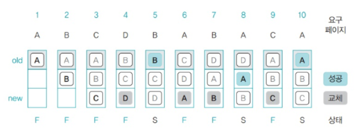
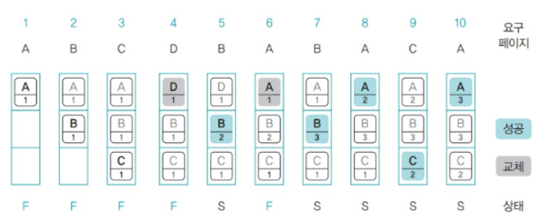
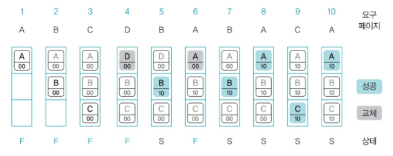

# 가상메모리, 요구페이징, 페이지 교체 알고리즘
## 가상 메모리(virtual memory)

### **가상 메모리란?**
물리 메모리의 크기와 상관없이 프로세스에 커다란 메모리 공간을 제공하는 기술이다. 

 

### **가상 메모리의 필요성**
프로세스가 실행되는 코드 전체를 물리 메모리에 존재시킨다면, 메모리 용량보다 큰 프로그램은 실행될 수 없다. 또한 여러 프로그램이 동시에 메모리에 올라갈 경우, 용량 문제나 성능 이슈가 발생했다. 하지만, 실제로는 코드의 일부분에서만 시간을 사용하고, 특정 순간에는 항상 작은 양의 주소 공간을 사용한다.  
가상 메모리는 이러한 물리적 메모리의 한계를 극복하기 위해 나온 기술이다. 프로세스를 실행할 때 실행에 필요한 일부만 메모리에 로드하고 나머지는 디스크에 두는 것이다. 하드디스크에 존재하지만, 메모리 관리자가 관리하는 영역을 스왑 영역이라고 한다. 즉, 가상 메모리의 크기는 물리 메모리의 크기와 스왑 영역을 합한 크기이다.

 

### **가상 메모리 시스템이 하는 일**
가상 메모리는 실제의 물리 메모리 개념과 사용자의 논리 메모리 개념을 분리한 것이다.
프로세스는 가상 주소를 사용하고, 실제 해당 주소에서 데이터에 접근할 때 물리 주소로 바꿔주는 개념이다.
<li> virtual address (가상 주소) : 프로세스가 참조하는 주소.
<li> physical address (물리 주소) : 실제 메모리 주소
<li> MMU(Memory Management Unit) : CPU 코드 실행 시, 가상 주소 메모리 접근이 필요할 때, 해당 주소를 물리 주소값으로 변환해주는 하드웨어 장치.
이러한 과정을 동적 주소 변환(Dynamic Address Translation, DAT)라고 한다.
 

 

 
 

## 요구페이징(Demand Paging)

### **요구페이징이란?**
프로세스가 필요로 하는 데이터를 프로세스가 요청할 때 메모리에 적재하는 방법이다.

 

### **요구페이징의 개요**
용량이 큰 프로세스를 실행한다고 가정하자. 운영체제는 프로세스를 구성하는 모듈을 전부 메모리에 올리지 않는다. 필요한 모듈만 메모리에 올려 실행하고 나머지 모듈은 필요하다고 판단될 때 메모리에 적재한다. 이유는 다음과 같다.

 

<ul>
    <li> 메모리를 효율적으로 관리하기 위해서이다. 메모리가 꽉 차면 관리하기 어려우므로 가급적 적은 양의 프로세스만 유지한다.
    <li>응답 속도 향상을 위해서다. 용량이 큰 프로세스를 전부 메모리로 가져와 실행하면 응답이 늦어질 수 있으므로 필요한 모듈만 올려 실행한다.
</ul>

 
 

# 페이지 교체 알고리즘

## 페이지 교체 알고리즘이란?
페이지 폴트(Page Fault)가 발생할 시 어떤 프레임을 선택하여 교체할지 결정하는 방법이다.

 

## 페이지 교체 알고리즘의 필요성
요구페이징에서 언급한대로 프로그램을 실행할 때 , 모든 프로세스가 메모리에 올라오는 것이 아니다.
**프로세스가 요구한 페이지가 현재 메모리에 없으면 페이지 부재(page fault)가 발생**한다.
페이지 부재 발생 시 원하는 페이지를 보조저장장치에서 가지고 온다. 하지만, 만약 물리 메모리가 모두 사용중이라면, 페이지 교체가 이루어진다.
 
메모리에서 앞으로 사용할 가능성이 적은 페이지를 교체 대상 페이지로 선정해야 페이지 부재를 줄이고 시스템의 성능을 향상시킬 수 있다.

 

## 페이지 교체 알고리즘의 성능 평가 기준
같은 메모리 접근 패턴을 사용하는 두 알고리즘을 실행하여 페이지 부재 횟수를 세어 볼 수도 있고, 평균 대기 시간을 측정할 수도 있고, 전체 작업에 걸리는 시간을 비교할 수도있다. 
기본적으로는 **페이지 부재 발생 비율을 줄이는 것을 목표**로 한다.

 

## 페이지 교체 알고리즘 종류

1. **최적 페이지 교체 알고리즘(Optimal page replacement algorithm)** 
앞으로 가장 오랫동안 사용되지 않을 페이지를 찾아 교체하는 것이다. 미래의 접근 패턴을 보고 대상 페이지를 결정하는 알고리즘이다.

    - 장점
        - 알고리즘 중 가장 낮은 페이지 부재율을 보장한다.
    - 단점
        - 구현이 어렵다. 미래의 접근 패턴을 안다는 것이 실제로는 불가능하기 때문이다.
    - 특징
        - 주로 비교 연구 목적을 위해 사용한다. 구현이 가능하며, 이상적인 최적 페이지 교체 알고리즘에 근접하는 LRU, LFU, NUR등이 개발되었다.

  

2. **FIFO(First In First Out) 페이지 교체 알고리즘** 
선입선출 페이지 교체 알고리즘이라고도 하며, 시간상 메모리에 가장 먼저 들어온 페이지를 대상 페이지로 선정하여 교체하는 것이다. 구현은 큐(Queue)로 한다.

 

    

    - 장점
        - 가장 간단한 알고리즘으로 구현하기 쉽다.
    - 단점
        - 오래된 페이지가 항상 불필요하지 않은 정보를 포함하지 않을 수 있다. (ex. 초기 변수)
        - 오히려 페이지 부재율을 높일 수도 있다.
    - 특징
        - 페이지 부재율이 높을 경우, 페이지 프레임을 늘리면 직관적으로 생각할 때 페이지 부재율이 감소할 것으로 예상된다. 그러나 오히려 페이지 부재율이 증가하는 이상현상을 Belady가 발견했는데, 이를 Belady의 이상현상이라고 한다. 이는 사례를 통해 확인할 수 있다.

 

        페이지 프레임이 3일 때, 총 9번의 페이지 부재가 발생한다.

 
   
        페이지 프레임을 4로 늘렸는데 총 10번의 페이지 부재가 발생한다는 것을 확인할 수 있다.
    

  

3. **LRU(Least Recentle Used) 페이지 교체 알고리즘** 
페이지에 접근한 시간을 기준으로 대상 페이지를 선정한다. 즉, 가장 오랫동안 사용되지 않은 페이지를 선택하는 것이다.

    ### 구현 방법
    #### a. 페이지 접근 시간에 기반한 구현 
    가장 간단한 구현 형태로 페이지에 접근한 시간을 기록하여 구현한다.

 

    편의상 시간을 초라고 가정했을 때, 페이지가 메모리에 올라온 시간을 표시했다. 이 시간이 가장 적은 페이지를 교체하는 것이다. 예를 들어 6초의 경우 페이지 A를 올리기 위해 가장 오래 접근하지 않은 C를 교체한다.

- 특징 
    - 일반적으로 FIFO 알고리즘 보다 우수하고 최적 페이지 알고리즘 보다 성능이 떨어진다.
    - 숫자를 표시하기 위해추가 공간을 사용해야 한다.  

    #### b. 참조 비트 시프트 방식
    참조 페이지에 일정 크기의 참조 비트를 만들어 사용하는 것이다.  

 

    각 페이지에 일정한 크기의 참조 비트를 만든다. 초깃값은 0이고 접근할 때마다 1로 바뀐다. 그리고 주기적으로 오른쪽으로 shift한다.  

  

    이를 LFU 페이지 교체 알고리즘과 혼동하기도 한다. 다음 그림을 보면 A에는 4번, B에는 1번, C에는 5번 접근했다. 그러나 가장 최근에 접근한 페이지는 B이고, 가장 오랫동안 참조하지 않은 알고리즘은 C이므로 C를 교체한다.

- 특징
    - 참조 비트의 공간을 추가로 할당해주어야 한다.

  

4. **LFU(Least Frequently Used) 페이지 교체 알고리즘** 
페이지가 사용된 횟수를 기준으로 대상 페이지를 선정한다. 즉, 참조 횟수가 가장 적은 페이지를 교체하는 방법이다.

  

    메모리 접근 순서 5번을 보면 페이지 B의 사용 빈도가 1에서 2로 증가했다. 이어서 메모리 접근 순서 6번에서 페이지 부재가 일어나는데 이때 페이지 B는 대상 페이지에서 제외되고, 사용 빈도가 같은 페이지 C와 D 중에서 맨 처음에 있는 페이지 D가 교체 대상이 된다.   

- 특징
    - 활발하게 사용되는 페이지가 참조 횟수가 많을 것이라는 가정에 기반하여 만들어진 알고리즘이다. 
    - 최적 페이지 교체를 제대로 근사하지 못한다.
    - 페이지 접근 횟수를 표시해야 하기 때문에 추가 공간이 필요하다.

 
 

5. **NUR(Not Used Recently) 페이지 교체 알고리즘** 
LRU, LFU 페이지 교체 알고리즘과 성능은 유사하면서 불필요한 메모리 낭비를 해결한 알고리즘이다. 최근에 미사용된 페이지를 교체하는 알고리즘이다. 즉, LRU 알고리즘을 근사하는 알고리즘이다. 
알고리즘에서 접근 시간이나 접근 빈도를 **정확한 값**으로 저장하는 것은 공간만 많이 차지할 뿐 큰 의미가 없다. 따라서 이러한 경향을 반영하여 적은 오버헤드로 적절한 성능을 보장하는 알고리즘이다.  

    페이지마다 참조 비트와 변경 비트를 가진다. (초깃값 0)
* 참조 비트 : 페이지가 접근하면 1이 됨.
* 변경 비트 : 페이지가 변경되면 1이 됨.
 

#### 알고리즘 원리
- 모든 페이지의 초기 상태는 (0,0)이다.
- 페이지에 읽기 또는 실행 같은 '접근'이 발생하면 (1,0)으로 바뀐다.
 페이지에 쓰기 또는 추가 같은 '변경'이 발생하면 (0,1)이 된다.
 접근과 변경, 두 가지 연산이 다 발생하면 (1,1)이 된다.
- 교체 페이지를 선정할 때는 먼저 **참조 비트**를 고려하고, 그 다음 **변경 비트**를 고려한다.
- 즉, (0, 0), (0, 1), (1, 0), (1, 1) 순서대로 고르는 것이다.
- 모든 페이지가 (1, 1)이면 모든 비트를 (0, 0)으로 초기화한다. (거의 발생X)
 

 

    처음 메모리에 적재되는 페이지의 비트는 (0, 0)이다. 5번째에 페이지 B에 접근하면 비트가 (1, 0)으로 바뀐다.  
    6번째에 페이지 A에 접근하면 C와 D 중 위에 있는 D가 교체 대상이 된다.

* 특징
    * 단 2bit 만으로 LRU, LFU와 비슷한 성능을 가진다.

  

6. **2차 기회 페이지 교체 알고리즘**  
FIFO 페이지 교체 알고리즘을 보완한 것이다. 마찬가지고 큐를 사용하지만, 차이점은 특정 페이지에 접근하여 페이지 부재 없이 성공할 경우 해당 페이지를 큐의 맨 뒤로 이동하여 마치 새로 적재된 것과 같은 순서를 적용한다는 것이다.(기회를 한번 더 줌)

 
    메모리 접근 순서 5번에서 맨 앞에 있던 페이지 B는 성공한 후 큐의 맨 뒤로 옮겨져서 교체 페이지 대상에서 가장 후순위를 갖는다.(기회를 한 번 더 준다)

      

7. **시계 알고리즘(clock algorithm)**  
FIFO 페이지 교체 알고리즘을 보완한 것이다. 그러나 2차 기회 페이지 교체 알고리즘과의 차이점은 원형큐를 사용한다.

   

 * 특징
    * 스왑 영역으로 옮길 대상 페이지를 가리키는 포인터를 사용한다. 이 포인터가 큐의 맨 바닥으로 내려가면 다음 번에는 다시 큐를 가리킨다.
    * 포인터가 시계처럼 한 방향으로 돌기 때문에 시계 알고리즘이라고 부른다.
    * 참조 비트가 하나씩 추가된다. 참조 비트의 초깃값은 0이다.
    * 메모리에 있는 페이지를 성공적으로 참조하면 0에서 1로 변경된다.
     
     
    

    
     
        1. 1번에서 A가 메모리에 올라오면 대상 포인터는 페이지 A를 가리킨다.
        2. 2, 3번 페이지 B, C가 메모리에 올라온다.
        3. 4번에서 대상 포인터가 가리키는 페이지 A가 교체 페이지가 되어 쫓겨나고, 페이지 D가 메모리에 올라온다. 대상 포인터는 한 칸 아래인 페이지 B로 이동한다.
        4. 5번에서 페이지 B가 페이지 참조에 성공하면 페이지 B의 참조 비트는 1이 되어 기회를 얻는다. 대상 포인터는 페이지의 B의 참조 비트를 0으로 만든 후 한 칸 아래인 페이지 C로 이동한다.
        5. 6번에서 대상 포인터가 가리키는 페이지 C가 스왑 영역으로 가고 페이지 A가 메모리에 올라온다. 대상 포인터는 원을 돌아 메모리의 맨 위인 페이지 D로 이동한다.
        6. 7, 8번에서 페이지 B와 A를 성공적으로 참조하여 참조 비트를 1로 바꾼다.
        7. 9번에서 대상 포인터가 가리키는 페이지 D가 스왑 영역으로 가고 페이지 C가 메모리에 올라온다. 이때 대상 포인터는 밑으로 이동하는데, 페이지 B와 A 둘 다 참조 비트가 1이므로 0으로 변경한 후 건너뛴다. 대상 포인터는 다시 맨 위의 페이지 C를 가리킨다.

* 주의사항
    * NUR과의 혼동. 먼저 적재된 PAGE가 교체될 가능성이 높으므로 FIFO 알고리즘의 개선으로 볼 수 있음.
    * Reference bit을 사용하여 교체 페이지를 결정한다는 것은 NUR(LRU)와 유사함. 그래서 clock 알고리즘의 개선을 nur로 보거나, nur을 clock algorithm으로 명명하는 경우도 있음. 주의!!

    

내용 참고
- https://github.com/JaeYeopHan/Interview_Question_for_Beginner/tree/master/OS#%EA%B0%80%EC%83%81-%EB%A9%94%EB%AA%A8%EB%A6%AC
- https://www.fun-coding.org/virtualmemory.html
- https://melonicedlatte.com/2020/10/13/003700.html
- https://m.blog.naver.com/PostView.naver?isHttpsRedirect=true&blogId=kimbh666&logNo=221554253511
- https://zangzangs.tistory.com/143
- https://rebro.kr/179 
- https://velog.io/@ready2start/%EC%9A%B4%EC%98%81%EC%B2%B4%EC%A0%9C-09-Virtual-Memory
- [쉽게 배우는 운영체제] - 한빛 아카데미

