# 입출력 시스템과 디스크 관리

## 입출력 시스템

### 입출력 장치와 채널

컴퓨터에는 필수 장치(CPU, 메모리)와 주변장치(입출력장치, 저장장치)로 구성된다. 다양한 주변장치는 데이터 전송 속도에 따라 **저속 주변장치**와 **고속 주변장치**로 구분된다. 각 장치는 메인 보드에 있는 버스로 연결된다.

- **저속 주변장치**: 메모리와 주변장치 사에이 오고 가는 데이터 양이 적어 데이터 전송률이 낮은 장치. ex) 키보드, 마우스, 스캐너
- **고속 주변장치**: 메모리와 주변장치 사에이 오고 가는 데이터 양이 많아 데이터 전송률이 높은 장치. ex) 그래픽 카드(초당 수집장의 그래픽을 보여주어야 함)

버스는 여러 개의 버스를 묶어서 사용한다. 그 통로를 **채널**이라고 한다. 여러 채널을 효율적으로 사용하기 위해 전송 속도가 비슷한 장치끼리 묶어서 채널을 할당한다.

cf) 버스란? 버스(영어: bus[1], 문화어: 모선)는 컴퓨터 안의 부품들 간에, 또는 컴퓨터 간에 데이터와 정보를 전송하는 통로(통신 시스템)이다. 이러한 표현에는 관련된 모든 하드웨어 부품들 (선, 광섬유 등) 및 통신 프로토콜을 포함한 소프트웨어를 아우른다.

cf) 채널이란? 데이터가 지나다니는 통로와 같은 것. 도로의 차선이라고 이해하면 됨. ex. 4채널 버스는 주변장치가 4개의 주변장치가 동시에 데이터를 주고 받을 수 있는 4차선 도로와 같다.
 

### 입출력 버스의 구조

#### 폴링 방식(초기 구조)
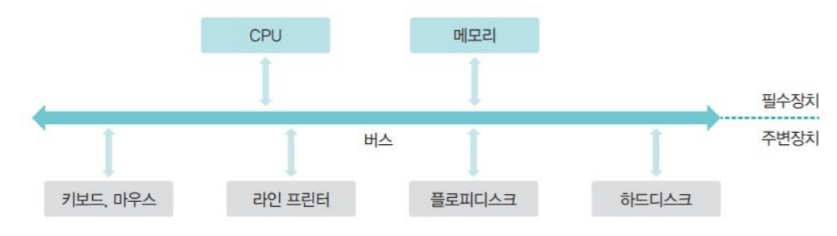

초기에는 모든 장치가 하나의 버스로 연결되고, CPU가 작업을 진행하다가 입출력 명령을 만나면 직접 입출력 장치에서 데이터를 가져왔는데 이를 **폴링(polling) 방식**이라고 한다.

- 폴링 방식: 하드웨어 상태를 수시로 체크하여 명령을 받을 수 있는지 확인

그러나 주변 장치는 CPU와 메모리보다 매우 느리다. 따라서 폴링 방식을 사용하면 CPU 대기 시간이 길어져 작업의 속도가 매우 느려진다.

#### 입출력 제어기를 사용한 구조
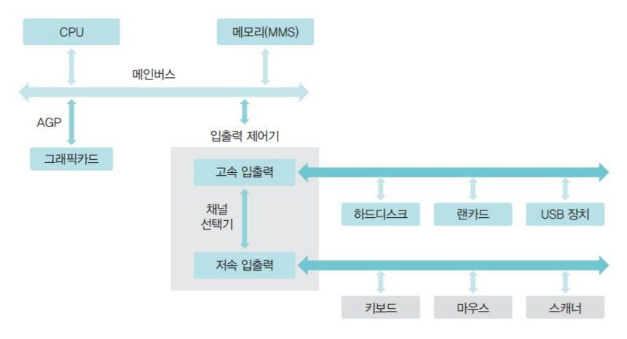

CPU와 메모리 성능이 향상되고, 주변 장치 종류가 다양해졌다. 폴링 방식의 한계 때문에 모든 입출력을 **입출력 제어기(I/O Controller)에** 맡기는 구조로 바뀌었다.

입출력 제어기는 2개의 채널로 나뉜다. **메인버스**는 고속으로 작동하는 CPU와 메모리를, **입출력 버스**는 주변장치가 사용한다. 입출력 버스는 다시 **고속 입출력 버스**와 **저속 입출력 버스**로 분리해서 운영한다. (두 버스 사이의 데이터 전송은 채널 선택기가 관리)

이로인해 폴링 방식의 단점을 해결하여 전체 작업 효율이 향상된다.

그래픽 카드는 입출력장치이지만, 화면의 해상도가 높아지고 3D 게임의 보급으로 그래픽카드가 처리해야하는 양이 늘어났다. 입출력 버스로 감당하기 어려워진 그래픽 카드는 입출력버스에서 분리하고 메인버스에 바로 연결하여 사용한다.

### 직접 메모리 접근

입출력 제어기는 다양한 주변장치의 입출력을 대행하고 여러 채널에서 온 데이터를 메모리로 옮긴다. 그런데 메모리는 CPU의 명령에 따라 작동한다.
직접 메모리 접근(DMA)은 CPU의 도움 없이 메모리에 접근할 수 있도록 입출력 제어기에 부여된 권한이다. 입출력 제어기에는 직접 메모리에 접근하기 위한 **DMA 제어기**가 마련되어 있다.

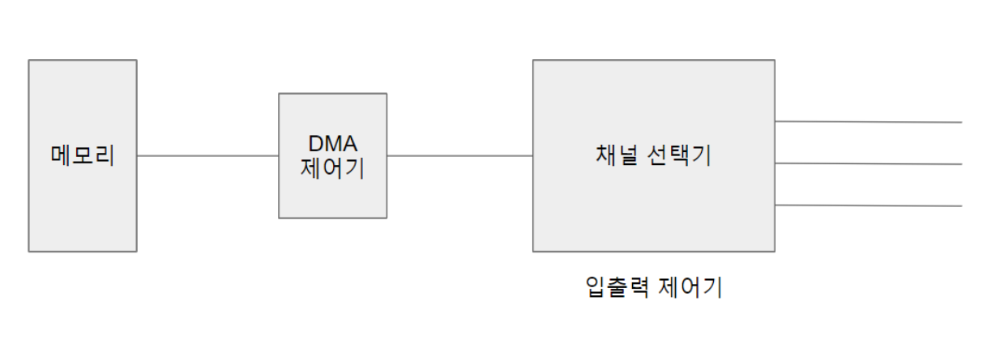

입출력 제어기는 여러 채널에 연결된 주변 장치로부터 전송된 데이터를 적절히 배분하여 하나의 흐름을 만들고, 채널 선택기는 여러 채널에서 전송된 데이터 중 어떤 것을 메모리로 보낼지 결정한다. 전송된 데이터는 DMA 제어기를 거쳐 메모리에 올라간다.

### 인터럽트

인터럽트는 입출력 제어기가 주변장치의 입출력 요구나 하드웨어 이상 현상을 CPU에 알려주는 역할을 하는 신호다.

ex) CPU가 요청 한 작업을 완료했을 때, 키보드로 데이터를 입력받았을 때, 네트워크 카드에 새로운 데이터가 도착했을 때, 하드웨어에 이상이 생겼을 때.

CPU는 인터럽트를 받아도 어떤 장치의 인터럽트인지 확인하기 어렵다. 따라서 각 장치에는 **IRQ**라는 고유의 인터럽트 번호가 부여되어 있고, IRQ를 통해 CPU는 어떤 장치에서 발생한 인터럽트인지 파악한다.

- 외부 인터럽트: 입출력 및 하드웨어 관련 인터럽트(ex. 전원 이상, 기계적 오류)
- 내부 인터럽트: 프로세스의 오류로 발생하는 인터럽트(ex. 숫자 0으로 나누기, 주소공간 벗어나는 작업하기)
- 시그널: 사용자의 요청으로 발생하는 인터럽트(ex. 리눅스에서 ctrl + c로 작동중인 프로세스 끝내기)

### 버퍼링

버퍼는 속도가 다른 두 장치의 속도 차이를 완화하는 역할을 한다. 입출력 장치는 느린 장치를 통해 들어오는 데이터를 버퍼에 모아 한꺼번에 이동시켜 느린 속도를 보완한다.

 이 때 단일 버퍼 대신 이중 버퍼를 사용하여 한 버퍼는 데이터를 담는 용도로 쓰고 다른 버퍼는 데이터를 가져가는 용도로 쓴다.

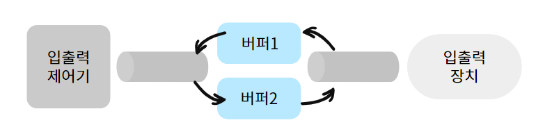

시스템 효율성을 위해 운영체제에서는 버퍼가 가득 찼을 때 입출력장치로 데이터를 전송하도록 설계되어 있다. 이러한 특성 때문에 외부 저장 장치를 제거하거나 파일 입출력 시 버퍼에만 있고 저장장치에는 반영되지 않는 경우가 생길 수 있다.

 

---

 

## 디스크 관리

최근에는 메모리 가격이 많이 낮아져 USB 메모리나 SSD 같은 반도체를 이용한 저장 장치가 많이 보급되었다. 하지만 여전히 대용량 데이터 저장을 위해 하드디스크(Hard Disk Drive, HDD)를 많이 사용한다. 
- 하드디스크 : 움직이는 헤드를 가진 하드디스크 드라이브

### 하드 디스크 구조

하드디스크는 스핀들(spindle)이라는 원통 축에 여러 개의 플래터(platter)가 달려있는 구조이다.

- 플래터 : 표면에 자성체가 발려 있어 자기를 이용하여 0과 1의 데이터를 저장. 항상 일정한 속도로 회전함. (일반적으로 일반 컴퓨터에는 3.5인치를 노트북에는 2.5인치를 사용)
- 섹터: 물리적 개념. 하드디스크의 가장 적은 저장 단위.
- 블록 : 논리적 개념. 하드디스크와 컴퓨터 사이에 데이터를 저장하는 논리적 저장 단위 중 가장 작은 저장 단위
- 트랙: 플래터에서 회전축을 중심으로 데이터가 기록되는 동심원(섹터의 집합)
- 실린더: 여러 개의 플래터에 있는 같은 트랙의 집합
- 헤드: 데이터를 읽거나 쓸 때 사용하는 부위

하드디스크는 구조상 외부 충격에 민감하다.

* 각속도 일정 방식의 회전 : 일정한 시간 동안 이동한 각도가 같다.

하드디스크의 플래터는 항상 일정한 속도로 회전하여 바깥쪽 트랙의 속도가 안쪽 트랙의 속도보다 훨씬 빠르다.

### 디스크의 데이터 전송 시간

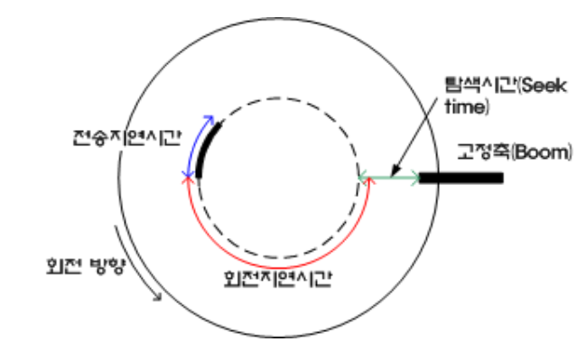

- 탐색 시간: 헤드가 특정 섹터의 트랙까지 이동하는데 걸리는 시간
- 회전 지연 시간: 플래터가 회전하여 원하는 섹터를 만날 때 까지 걸리는 시간
- 전송 시간: 헤드가 섹터에 있는 데이터를 읽어 전송하는 시간

데이터 전송 시간 = 탐색 시간 + 회전 지연 시간 + 전송 시간

 

---

 

### 디스크 스케줄링

디스크는 매우 느리지만 자주 사용하는 저장장치이다. 디스크의 데이터 전송 시간 중에는 탐색 시간이 가장 느리다. 디스크 스케줄링(disk scheduling)은 트랙의 이동을 최소화하여 이 탐색 시간을 줄이는데 목적이 있다.

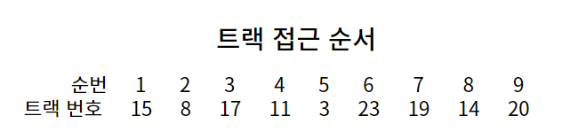

#### FCFS 디스크 스케줄링
- 15 -> 8 -> 17 -> 11 -> 3 -> 23 -> 19 -> 14 -> 20 (이동 거리 65)
- 가장 단순한 디스크 스케줄링 방식으로, 요청이 들어온 트랙 순서대로 서비스 

#### SSTF(Shortest Seek Time First) 디스크 스케줄링
- 15 -> 14 -> 17 -> 19 -> 20 -> 23 -> 11 -> 8 -> 5 (이동 거리 31)
- 현재 헤드가 있는 위치에서 가장 가까운 트랙부터 서비스
- 만약 다음에 서비스할 두 트랙의 거리가 같다면 먼저 요청받는 트랙을 서비스
- 효율성은 좋지만 아사 현상을 일으킬 수 있음. 헤드가 중간에 위치하면 가장 안쪽이나 바깥쪽에 갈 확률이 적어짐

cf) 아사현상이란? 작업시간이 길다는 이유로 작업이 계속 연기되는 현상이다.

#### 블록 SSTF 스케줄링
- 15 -> 17 -> 8 -> 11 -> 3 -> 23 -> 20 -> 19 -> 15 (이동 거리 51)
- 위의 문제점을 어느 정도 해결한 방법
- 블록 단위로 트랙을 관리하여 멀리 있는 트랙도 몇 번만 양보하면 서비스 받을 수 있음(에이징 적용)
- FCFS 만큼 성능이 좋지 않다.

#### SCAN 디스크 스케줄링
- 15 -> 14 -> 11 -> 8 -> 3 -> 0 -> 17 -> 19 -> 20 -> 23 (이동 거리 38)
- SSTF의 공평성 위배 문제를 완화하기 위해 만들어진 기법
- 헤드가 한 방향으로만 움직이며 서비스를 함. 맨 마지막 트랙에 도착할 때까지 뒤돌아가지 않음
- SSTF 보다 성능이 조금 떨어지지만 FCFS 보다 성능이 좋음
- 가장 많이 사용되는 기법 중 하나. 그러나 동일한 트랙의 요청이 연속적으로 발생되면 헤드가 더 이상 나아가지 못해 바깥쪽 트랙이 아사 현상을 겪는 문제 발생

#### C-SCAN 디스크 스케줄링
- 15 -> 14 -> 11 -> 8 -> 3 -> 0 -> (작업없이 이동) -> 24 -> 23 -> 20 -> 19 -> 17 (이동 거리 46)
- SCAN 디스크 스케줄링도 헤드가 0번과 24번 트랙을 한 번씩 방문하는 동안 가운데 트랙은 2번씩 방문되는 단점이 있다.(바깥 트랙의 불이익) 따라서 SCAN 스케줄링을 변형하여서 한족 방향으로 움직일 때는 요청받은 트랙을 서비스하고 반대방향으로 돌아올 때는 이동만 하는 기법이다.
- SCAN 스케줄링처럼 한 방향으로 움직이며 서비스 하지만 마지막 트랙에 도착하면 다시 처음으로 돌아감
- 모든 트랙이 공평하게 서비스 받음. 그러나 작업 없이 헤드를 이동하여 매우 비효율적

#### LOOK 디스크 스케줄링
- 15 -> 14 -> 11 -> 8 -> 3 -> 17 -> 19 -> 20 -> 23 (이동 거리 35)
- 더 이상 서비스할 트랙이 없으면 헤드가 끝가지 가지 않고 중간에서 방향을 바꿈

#### C-LOOK 디스크 스케줄링
- 15 -> 14 -> 11 -> 8 -> 3 -> (작업없이 이동) -> 23 -> 20 -> 19 -> 17(이동 거리 38)
- C-SCAN의 LOOK 버전

#### SLTF(Shortest Latency Time First) 디스크 스케줄링

- 앞선 디스크 스케줄링과는 다른 방향이다. 앞선 스케줄링은 탐색 시간을 줄이기 위한 기법이었다면, 이는 헤드를 고정시키고, 모든 트랙을 읽을 수 있는 헤드를 지지대에 부착하는 방식이다. 헤드를 움직이는 탐색 시간이 없어서 매우 빠르나 고가라 잘 이용되지 않는다.
- 최소 지연 우선 기법(헤드 이동 시간이 아닌 회전 지연 시간을 최적화)

### RAID(Redundant Array of Inexpensive/Independent Disk)

개인 데이터의 크기가 급격히 증가했다. 하드디스크, USB, SSD와 같은 저장장치에 저장된 데이터는 영원할 것 같지만 그렇지 않다. 기계이기 때문에 수명이 있고, USB나 SSD도 최대 사용 횟수가 정해져 있기 때문이다. 따라서, 저장장치에 저장된 데이터는 수시로 백업을 해줘야하는데 이를 수동으로 한다면 매우 번거롭다. RAID는 자동으로 백업을 하고 장애 발생 시 이를 복구하는 시스템이다.

- 메모리가 아닌 값싼 디스크 여러개로 구성되어 있고, 장애 발생 시 데이터 복구에 사용됨. (Redundant Array of independent Disks)
- 자동으로 백업하고 장애 발생시 이를 복구하는 시스템
- 하나의 원본 디스크와 같은 크기의 백업 디스크에 같은 내용을 동시에 저장하고, 하나 디스크 고장시 다른 디스크 사용하여 복구.
- RAID 0, 1, 10, 2, 3, 4, 5, 6, 50, 60 등이 있음.

#### RAID 0(스트라이핑)

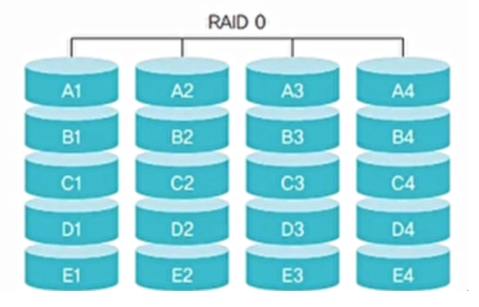

- 같은 규격의 디스크를 병렬로 연결하여 여러 개의 데이터를 여러 디스크에 동시에 저장하거나 가져올 수 있음
- 데이터를 여러 갈래로 찢어서 저장하기 때문에 스트라이핑이라고 부름
- N개의 디스크로 구성된 RAID 0은 1개의 디스크로 구성된 시스템보다 약 N배 빠름
- 장애 발생 시 복구하는 기능이 없음
- 따라서 속도는 증가하지만 안정성은 낮아짐

#### RAID 1(미러링)

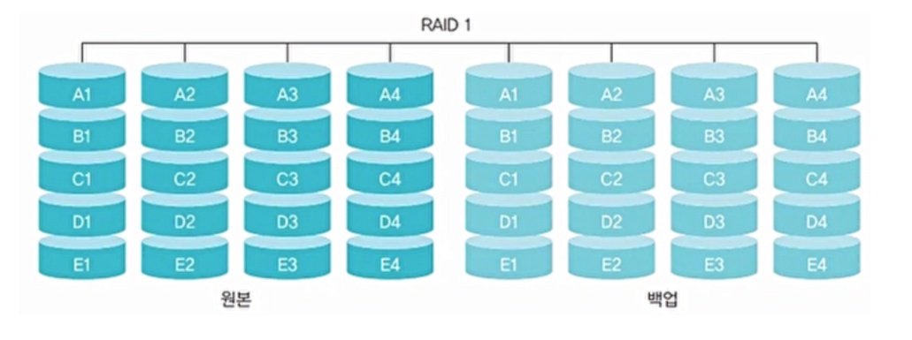

- 같은 데이터를 2개의 디스크에 저장(백업 디스크 활용)
- 같은 크기의 데이터를 최소 2개 이상 필요로 하며 짝수 개의 디스크로 구성
- 장애 발생시 미러링된 디스크를 활용하여 데이터를 복구할 수 있음
- 그러나 비용이 증가하고 같은 내용을 두 번 저장하기 때문에 속도가 느려짐

#### RAID 2

- 오류 교정 코드(ECC)를 따로 관리하여 오류가 발생하면 디스크를 복구
- 비트별로 만들어진 오류 교정 코드는 별도의 디스크에 따로 보관하고 있다가 장애 발생시 이 코드를 이용
- n개의 디스크에 대해 오류 교정 코드를 저장하기 위한 n-1개의 추가 디스크 필요
- 오류 교정 코드를 계산하는데 시간을 소비
- 잘 사용되지 않음

#### RAID 3

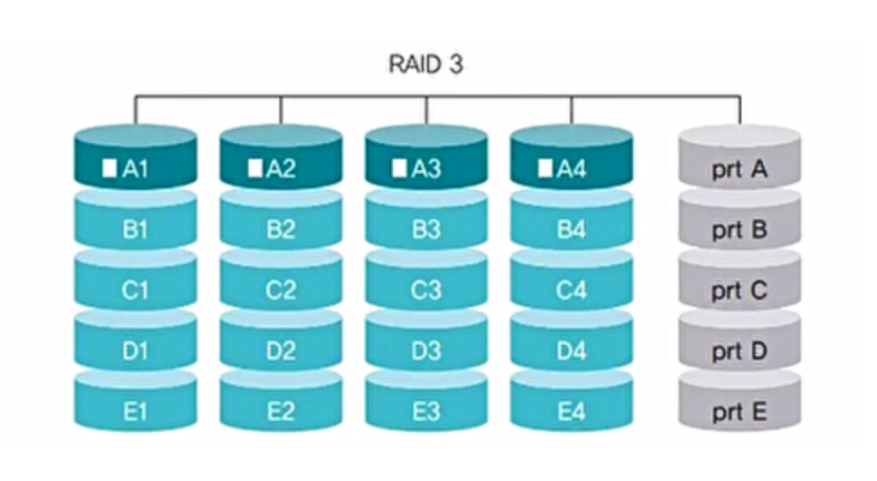

- 오류 검출 코드인 패리티를 사용하여 데이터를 복구.
- 섹터 단위로 데이터를 나누어 저장
짝수 패리티(1의 총수를 짝수로) 혹은 홀수 패리티(1의 총수를 홀수로)를 사용하여 장애가 난 비트를 추정
- 4개의 디스크당 1개 정도의 추가 디스크 필요
- 패리티 비트를 구성하는 데 많은 시간이 소비(데이터를 읽거나 쓸 때 패리티 비트를 구성하기 위해 모든 디스크가 동시에 동작해야 함)

#### RAID 4

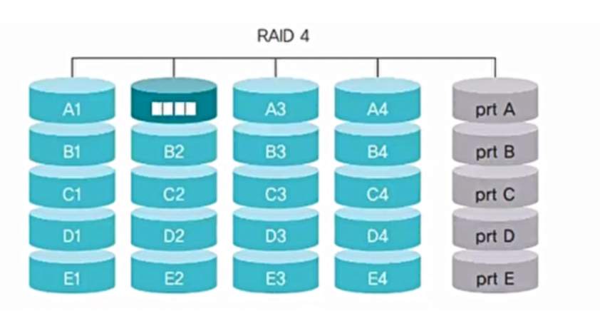

- RAID 3와 같은 방식이지만 블록 단위로 데이터를 나누어 저장
- 데이터가 저장되는 디스크와 패리티 비트가 저장되는 디스크만 동작한다는 것이 장점
- 패리티 비트를 추가하기 위한 계산량 많음. 그러나 추가되는 디스크 양 적음.

#### RAID 5

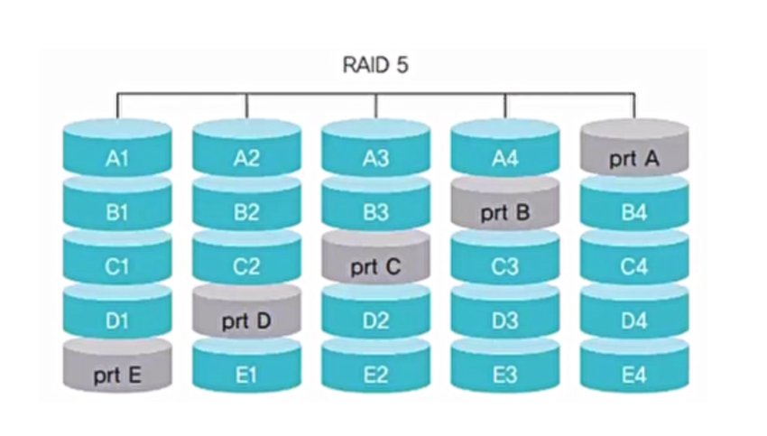

- 패리티비트를 여러 디스크에 분산하여 구성
- 병목 현상 완화
- 패리티 비트가 있는 디스크가 고장나도 복구 가능. 한 디스크에 장애 발생 시 다른 디스크에 있는 패리티 비트 이용해 복구

#### RAID 6

- RAID 5와 같은 방식이지만 패리티 비트가 2개
- RAID 5와 달리 디스크 2개가 동시에 장애가 발생했을 때도 복구 가능
- 패리티 비트를 2개씩 운영해서 부담이 커짐

#### RAID 10

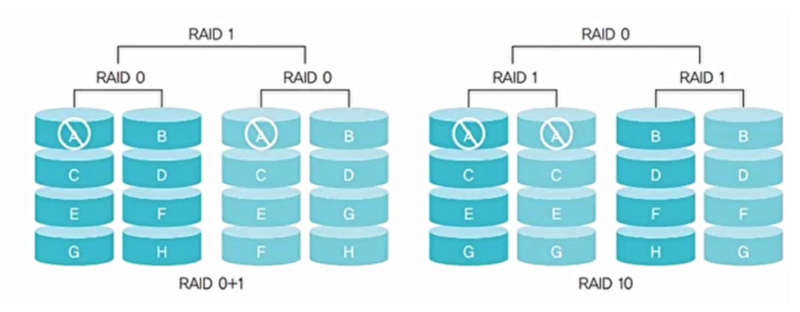

- 미러링 기능을 가진 RAID 1과 빠른 데이터 전송이 가능한 RAID 0을 결합한 형태
- RAID 01과 달리 일부 디스크만 중단하여 복구 가능

#### RAID 50 or 60

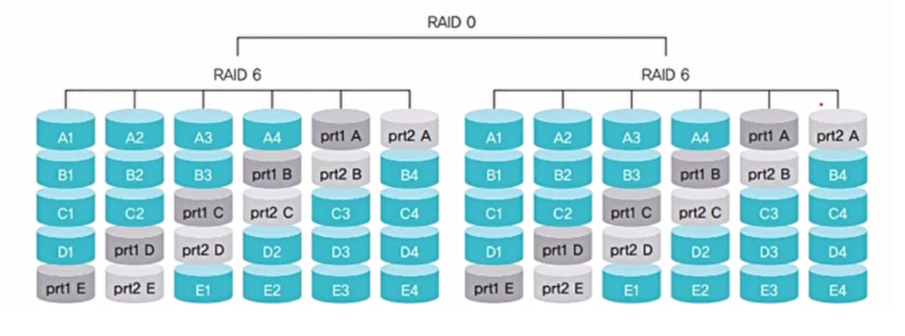

- RAID 5 또는 6으로 묶은 두 쌍을 다시 RAID 0으로 묶어 사용

> Reference
> - 쉽게 배우는 운영체제 by 조성호
> - https://tooo1.tistory.com/426
> - https://velog.io/@tnwls2/11.-%EC%9E%85%EC%B6%9C%EB%A0%A5-%EC%8B%9C%EC%8A%A4%ED%85%9C%EA%B3%BC-%EC%A0%80%EC%9E%A5%EC%9E%A5%EC%B9%98
> - https://blog.daum.net/dasomcap/
> - https://mgyo.tistory.com/500?category=927419
