# TL;DR (용어 정리)

- `파일` : 보조기억장치에 저장된 관련된 데이터 레코드들의 집합에 이름을 붙인 것
- `파일 속성` 또는 `파일 메타데이터` : 파일을 관리하기 위한 각종 정보들로 파일 자체의 내용은 아님   

- `디렉터리` : 모여있는 파일의 정보를 담고 있는 `파일` 로 파일을 관리하고 추적하기 위해 사용함
- `절대 경로` : root 로부터 목적지까지의 절대적인 경로
- `상대 경로` : 현재 위치를 기준으로 목적지까지의 경로   

- `파일 시스템` : 운영체제와 모든 데이터, 프로그램의 저장과 접근을 위한 기법을 제공하는 것
- `파티션` : 논리적인 디스크(Logical Disk). 연속된 저장 공간을 하나 이상의 연속되고 독립적인 영역으로 나누어 사용하도록 정의한 규약
- `마운트` : 여러 개의 파티션을 통합하는 명령어

  

# 파일 관리

- 프로세스 주소 공간에만 정보를 저장하면 다음과 같은 문제점이 발생한다.
  - 제한된 양만 저장이 가능하고,
  - 프로세스 종료시 정보가 사라지며
  - 다수의 프로세스가 동시에 정보에 접근하기 어렵다. 

- 따라서 `Long-term Information Storage` 의 필요성이 대두되었다.
  - `디스크`에 정보를 저장하면 메인 메모리보다 더 많은 정보를 저장할 수 있고,
  - 프로세스가 종료되어도 정보가 사라지지 않으며
  - 다수의 프로세스에서 정보를 동시에 접근할 수 있다.   

그렇다면 디스크에서 어떻게 정보를 찾고, 동기화 문제를 해결할 수 있을까?

이 문제를 `파일`이란 새로운 추상화를 통해 해결한다. 

즉, `파일 시스템`은 디스크에 존재하는 데이터를 저장하고 접근할 수 있는 기법을 제공한다.    

# 1. 파일

### 파일이란?

- "A named collection of related information"

- 파일이란 `보조기억장치`에 저장된 **관련된 데이터 레코드들의 집합**이다.  

> ☝️ 여기서 잠깐!  
>
> 그럼 PC에서 사용하는 `파일`이란 단어는 무엇일까?  
>
> PC에서의 파일은 **시스템 사용자가 이용할 수 있는 데이터의 실체**를 의미한다.  
>
> 그러나 사실 시스템도, 응용 프로그램도, 디스크에 저장되는 모든 단위는 파일이다.  
>
> 운영체제는 다양한 저장 장치를 동일한 단위로 구분하기 위해 `file`이라는 단위를 사용하는 것이다. 

 

- 모든 파일은 0과 1의 비트 패턴으로 이루어지고 크게 실행 파일과 데이터 파일로 나뉨
- 파일의 이름은 `파일 이름.확장자` 형태로 구성됨   

+) **실행 파일**

- 운영체제가 메모리로 가져와 CPU를 이용하여 작업을 하는 파일

- 사용자의 요청으로 프로세스가 된 파일을 의미한다.   

+) **데이터 파일** 

- 실행 파일이 작업하는데 필요한 데이터를 모아놓은 파일

- 스스로 프로세스가 될 수 없고, 전송되거나 보관만 됨

- ex) 이미지 뷰어 프로그램의 사진 파일, 뮤직 플레이어의 음악 파일 등   

### 파일의 설계

- 각 파일이 어떤 `속성`(파일 이름, 파일의 종류, 용량, 접근 시간 등)들을 가지게 할 것인지
- 각 파일에 저장될 데이터를 어떤 형식으로 저장하고 처리해야 효율적인지
- 파일을 어떤 `구조`로 편성할 것인지  

위와 같은 파일의 `속성`, `연산`, `구조` 등은 운영체제마다 다르다.

<b>파일의 속성 File Attribute</b>

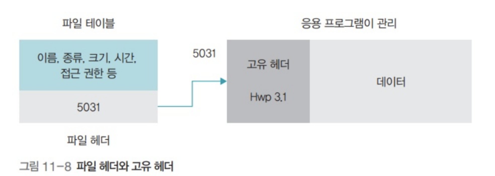  
파일의 속성들은 각 `파일 헤더`에 기록되며, 운영체제는 파일 헤더를 `파일 테이블`에서 관리한다. 		  

- name : 확장자를 포함한 전체 이름을 의미
- type : 실행 파일, 동영상 파일, 사진 파일 등 확장자로 구분
- size : 파일 용량을 의미
- time : 파일 접근 시간을 의미하며 만든 시간, 변경 시간, 최근 열어본 시간 등으로 세분화 
- location : 파일의 위치, 이름과 확장자가 같은 두 파일은 한 디렉터리에 존재할 수 없음 
- accessibility : 파일의 접근 권한을 의미  
- owner : 파일의 소유자라는 의미, 윈도우에는 거의 없지만 유닉스에서는 자주 사용됨   

운영체제가 관리하는 파일 헤더 외에 데이터 파일마다 자신에게 필요한 속성을 따로 정의할 때 `고유 헤더`를 사용한다.

  

<b>파일의 연산 File Operation</b>

       

파일 자체를 변경하거나, 파일의 내용을 변경하는 작업들을 말한다.  
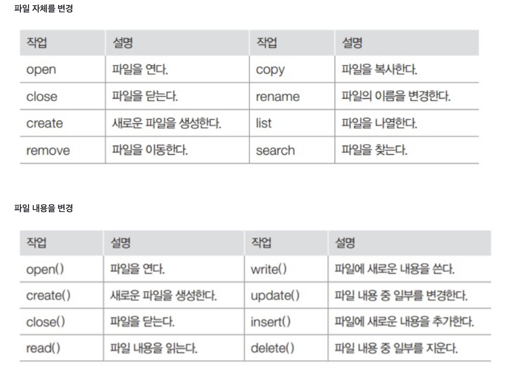  

  

  

<b>파일의 구조 File Structure</b>

       

### 순차 파일 구조
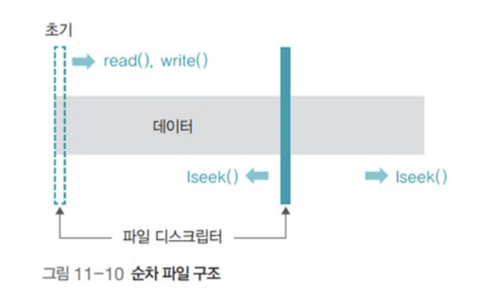  
파일의 내용이 하나의 긴 줄로 늘어선 형태   

#### 장점
- 모든 데이터가 순차적으로 기록되기 때문에 저장 공간 낭비가 없음
- 구조가 단순함
- 순서대로 데이터를 읽거나 저장할 때 매우 빠르다.  
  
#### 단점 
- 파일에 새로운 데이터를 삽입하거나 삭제할 때 오래 걸림
- 특정 데이터로의 이동 시 직접 접근이 어려워 데이터 검색에 적절하지 않음   

### 인덱스 파일 구조
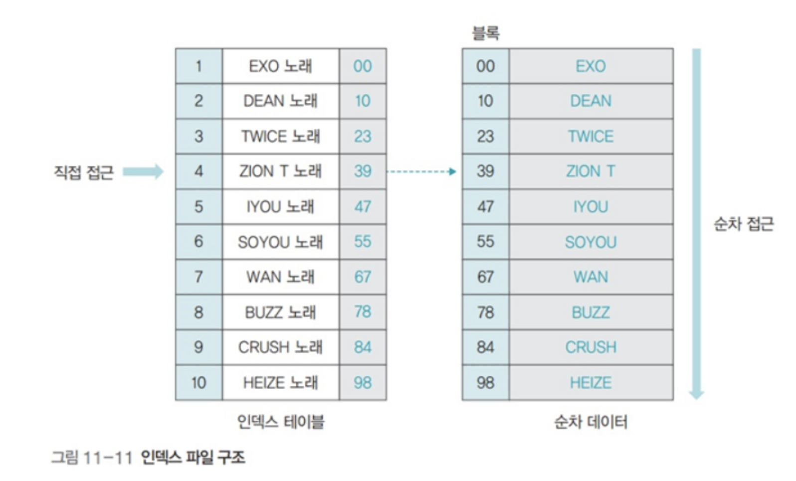  
인덱스 테이블을 이용해 순차 접근과 직접 접근이 가능한 형태  
현대의 파일 시스템은 인덱스 파일 구조로, 파일을 저장할 땐 순차 파일 구조로, 파일에 접근할 땐 인덱스 테이블을 보고 파일에 직접 접근한다.  

#### 장점
- 인덱스 테이블을 통해 다양한 접근이 가능
- 많은 양의 데이터를 처리할 때 효율적  
  
#### 단점 
- 인덱스 테이블을 위한 추가 저장 공간이 필요
- 인덱스 참조 시간이 추가됨   

  
### 집적 파일 구조
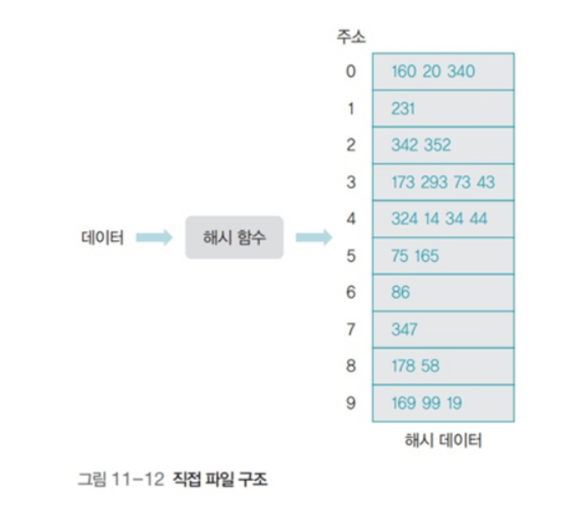  
저장하려는 데이터의 특정 값에 어떤 관계를 정의해 물리적인 주소로 바로 변환하는 파일 구조  
해시 함수를 이용해 직접 접근이 가능한데 실제로 많이 쓰이진 않는다.  

#### 장점
- 해시 함수를 이용해 주소를 변환하므로 데이터 접근이 빠르다  
  
#### 단점 
- 해시 함수를 찾기 어렵다
- 해시 함수를 잘 찾아도 저장 공간이 낭비될 수 있다   

  

  

# 2. 디렉터리

### 디렉터리란?

- 파일을 관리하고 추적하기 위해 사용하는 개념

- 관련있는 파일을 하나로 모아놓은 곳이다.
- 디렉터리는 여러 층으로 구성되고 최상위에 루트 디렉터리가 있다.   

> ☝️ 여기서 잠깐!  
>
> 디렉터리는 새로운 단위인가요? No!  
>
> `디렉터리`는 '모여있는 파일의 정보'를 담는 `파일` 입니다.

  

#### 경로

- `절대 경로` : 루트 디렉토리를 기준으로 파일의 위치를 나타내는 방식  

​		ex) /program/data/exam.c

- `상대 경로` : 현재 있는 위치를 기준으로 파일의 위치를 표시  

​		ex) data/exam.c   

#### 디렉터리 구조

디렉터리의 구조

       

### 1단계 디렉터리 구조

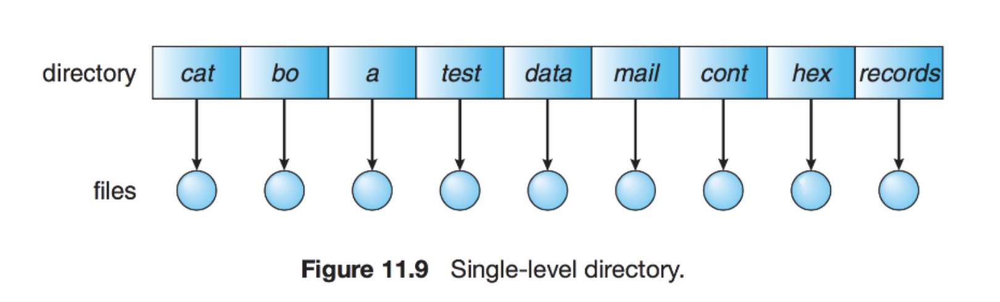  

가장 간단한 구조의 디렉터리로 각 파일은 사용자가 다르더라도 서로 유일한 이름을 가져야 한다.  

파일이 많아지거나 다수의 사용자가 사용하면 심각한 제약이 따른다.   

### 2단계 디렉터리 구조

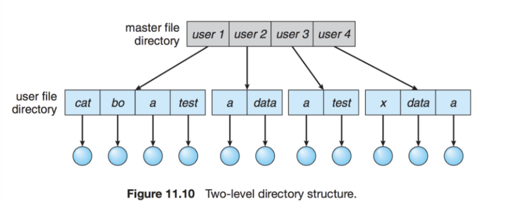  

사용자 별로 디렉터리를 만들어 관리하는 방법이다.  

사용자의 이름이나 계정 번호로 색인을 하고, 각 엔트리는 사용자 파일 디렉터리를 가리킨다.  

파일 참조 시 사용자의 파일 디렉터리에서만 탐색하므로 파일 이름 충돌 문제가 발생하지 않지만, 다른 사용자 파일에 접근해야 할 경우 단점이 된다.   

### 트리 디렉터리 구조

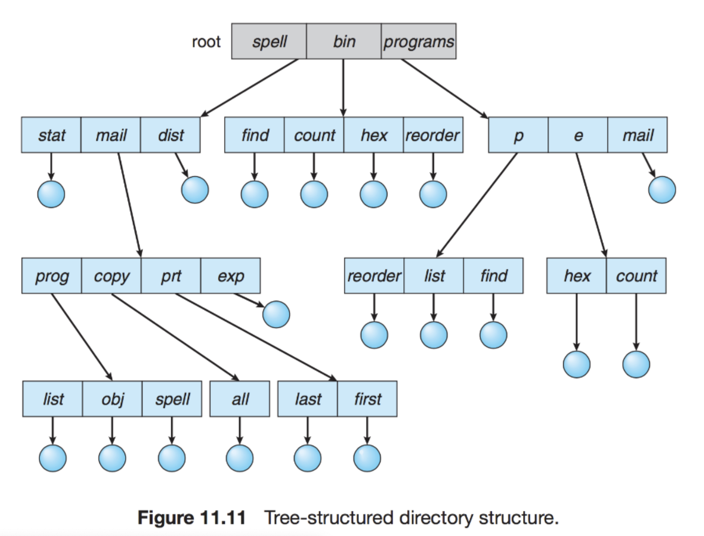  

2단계 디렉터리 구조를 확장해 다단계 트리 구조로 만든다.  

사용자들이 자신의 서브 디렉터리를 만들어 파일을 구성할 수 있도록 한다.  

디렉터리의 각 항목은 일반 파일인지(0) 디렉터리 파일인지(1) 항목을 추가해 구분한다.   

### 그래프 디렉터리 구조

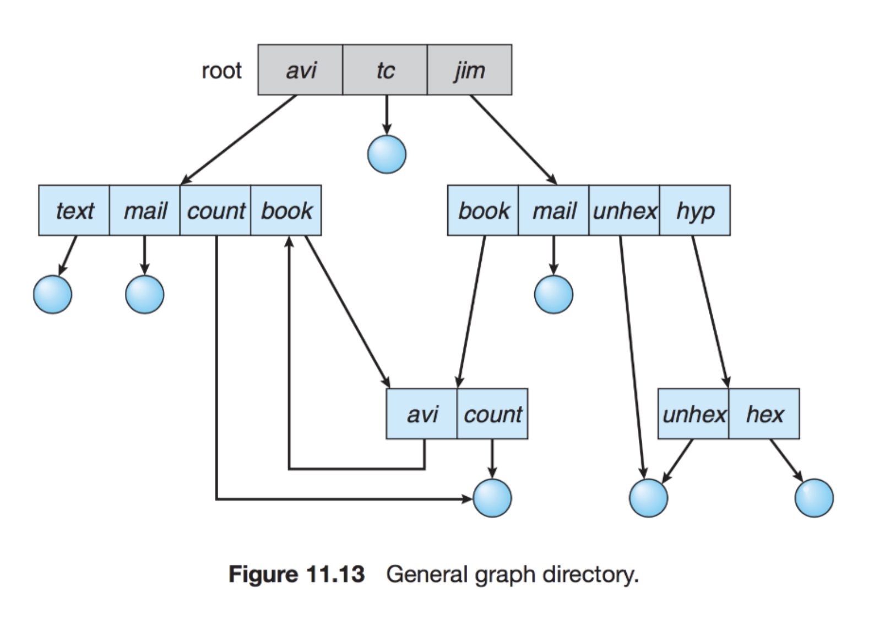  

디렉터리들이 서브 디렉터리와 파일을 공유할 수 있도록 허용한다.  

트리 구조의 디렉터리를 일반화한 방식으로 `링크` 라고 불리는 새로운 디렉터리 항목을 통해 파일을 공유한다.

  
# 3. 파일 시스템

파일 시스템은 디스크에 존재하는 데이터를 저장하고 접근할 수 있는 방법을 말한다. 

- 컴퓨터 내 다양한 파일은 하드디스크나 CD 같은 저장 장치에 보관하는데,
- 이러한 파일들을 `파일 관리자` 를 두어 저장 장치의 전체 관리를 맡긴다. => `파일 시스템`
- 파일 관리자는 파일 테이블을 이용해 파일을 관리하고,
- 파일 읽기, 쓰기, 실행과 같은 다양한 접근 방법을 제공한다.
- 이때 권한이 필요한데 이를 파일 디스크럽터(File Descriptor)라고 한다.  
- 

<b>파일 디스크립터</b>

파일 디스크럽터란 유닉스 계열의 시스템에서 프로세스가 파일을 다룰 때 사용하는 개념으로, 프로세스에서 특정 파일에 접근할 때 사용하는 추상적인 값이다.

- 프로세스가 실행 중에 파일을 Open하면 
- 커널은 해당 프로세스의 파일 디스크립터 숫자 중 사용하지 않는 가장 작은 값을 할당해준다. 
- 그 다음 프로세스가 열려있는 파일에 시스템 콜을 이용해서 접근할 때, 파일 디스크립터(FD)값을 이용해서 파일을 지칭할 수 있다.

  

#### 블록

- 블록은 저장 장치에서 사용하는 가장 작은 단위로 한 블록에 주소 하나가 할당되고,

- 데이터는 운영체제와 저장장치 간에 블록 단위로 전송된다.
- 블록의 크기는 시스템마다 다름 (시스템이 정한 기본 크기를 사용하거나 직접 지정)
- 블록 크기를 너무 작게 설정하면 내부 단편화 현상이 줄어들지만 파일이 여러 블록으로 나뉘어 파일 입출력 속도가 느려진다.   

## Layout

UNIX의 파일 시스템은 위와 같다.  

하나씩 살펴보자.

<b>Depth 1 - Hard Disk</b>

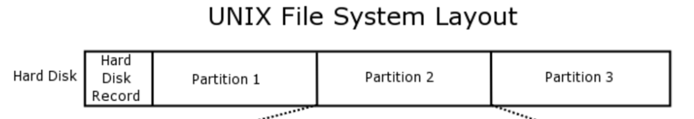  

하드 디스크는 다음으로 구성된다.

- MBR(Master Boot Record) : 기억 장치의 첫 섹터로 부팅에 사용된다.
- Partition table : 각 파티션의 정보가 담긴 테이블
- Disk Partition ( Partition1, Partition2, ....) : 각 파티션은 독립적인 `파일 시스템`이다.   

  

<b>Depth 2 - Partition </b>

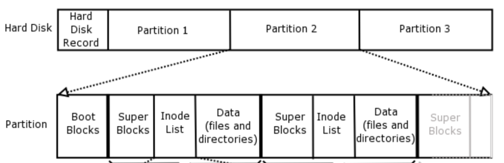  

하드 디스크 내 하나의 파티션(파일 시스템)은 다음으로 구성된다.

- Boot block
- Super block : 파일 시스템에서 가장 중요한 정보들
  - Magic number : 파일 시스템 타입을 식별하기 위한 정보
  - block의 수 
  -  ...
- Free space mgmt : `bitmap` or `pointer list`
- I-nodes : 파일 블록의 속성과 디스크 주소를 갖고 있는 정보들
  - UNIX 에서는 I-nodes 방식을 사용하지만  파일 시스템에서 파일을 어떻게 구현할 것이냐에 따라 달라진다.
- Root dir : 최상단의 정보
- Files and directories : 실제 데이터들   

  

  

## 파일 시스템 내 파일 구현 (Implementing Files)

### 1) Contiguous Allocation

파일을 연속된 디스크 블록에 저장하는 방법 

#### 장점

- 구현이 쉽다. (시작 주소와 block 개수만 알면 끝)
- 연속적으로 읽기 때문에 Read Performance가 좋다.  

#### 단점

- 디스크 외부 단편화  

=> CD-ROM처럼 파일 사이즈에 변화가 없는 시스템, 또는 동영상 서버처럼 파일 변경 없이 읽기만 하는 경우에 유용하다.  

### 2) 연결 할당 방식 

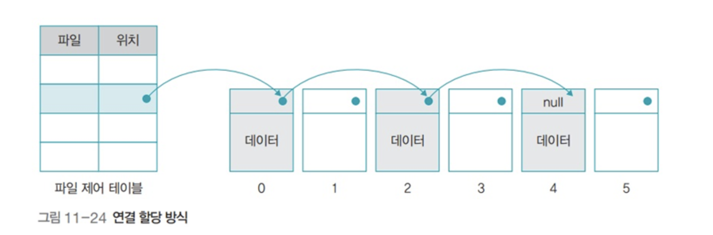

파일에 속한 데이터를 연결 리스트로 관리하는 방식 

#### 장점

- 디스크 외부 단편화가 없다 (물론 Internal은 항상 존재)
- 모든 디스크 블록을 사용할 수 있게 된다.   

#### 단점

- Random 접근이 매우 느리다. (뒷 block 읽으려면 모든 block을 디스크 접근으로 읽어야 한다.)
- pointer로 사용될 몇 바이트 때문에 저장되는 데이터의 양이 block 2개가 될 수 있다.  

### 3) 파일 테이블을 이용한 불연속 할당 (FAT)

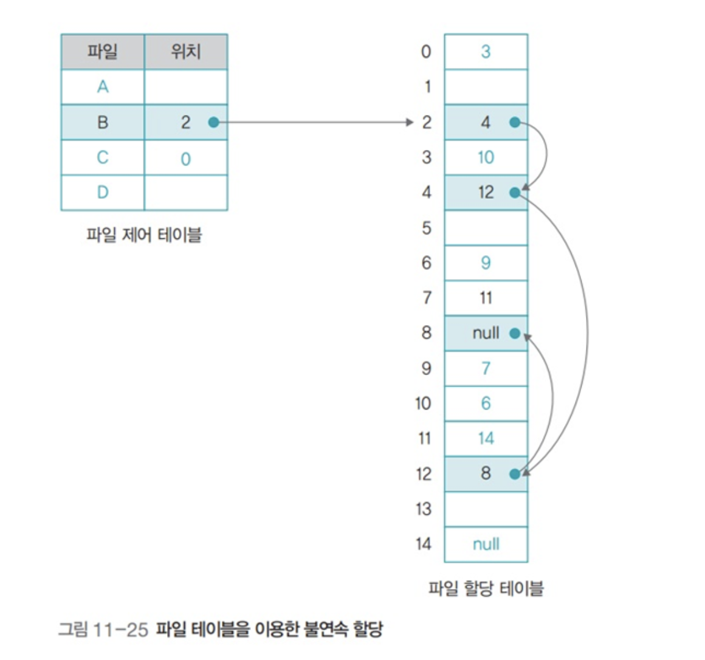

- File Allocation Table(FAT)을 메모리에다 저장해둔다.

  연결리스트에서 다음 블록을 가리키는 포인터 정보만 빼다가 테이블 만든 것 

  -> Random access 가 쉬워진다. Disk access 아닌 Mem access로 해결되니까.  

#### 단점

- 하나의 파티션이 사용할 수 있는 디스크 용량이 테이블의 주소 크기로 제한된다.

  ex) FAT16은 16bit 주소 → 32GB

- FAT 이 작지 않기 때문에 공간 차지를 꽤 하고, 

- FAT 이 깨지거나 망가지면 시스템이 다 날아가기 때문에 Fault에 취약함  

### 4)인덱스를 이용한 불연속 할당 (Index-node)

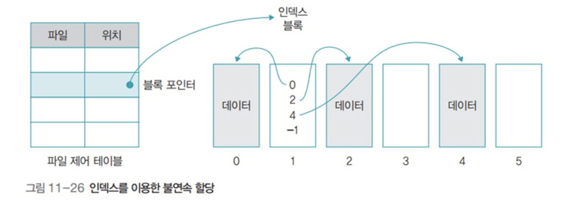

- 테이블의 블록 포인터가 데이터 블록을 연결하는 것이 아니라, 데이터의 인덱스를 담고 있는 **인덱스 블록**(**inode**)을 연결
- 인덱스 노드는 파일 하나당 한 개씩 배치되고, 파일이 오픈될 때 메모리에 올린다.
- 인덱스 블록은 실제 데이터의 위치에 관한 정보를 순서대로 보관
- 테이블이 꽉 차서 더 이상 데이터를 연결할 수 없을 때는 인덱스 블록을 연결하는 간접 인덱스 블록(. index block)을 만들어 테이블을 확장할 수 있음   

> ☝️ 여기서 잠깐!  
>
> 운영체제별 사용하고 있는 파일 시스템을 한 번 살펴보자.  
>
> - Windows : FAT(12/16/32), NTFS
> - Linux : ext(2/3/4)
> - MacOS : HFS, HFS+, APFS
> - Google : GFS (구글 사내에서 사용하기 위한 파일 시스템)
>
>  이렇듯 운영체제별로 파일 시스템이 다르기 때문에 파일 읽기/쓰기/실행이 꼬이는 것이다.

<b> 운영체제별 파일 시스템 </b>

#### FAT (File Allocation Table)

- FAT에 파일의 위치를 기록하고 관리한다.
- 저용량에 적합하고 보안성이 좋지 못하지만, 다양한 운영체제에서 지원해 호환성이 좋다.

#### NTFS

- FAT을 보완하기 위해 만들어진 윈도우 계열의 파일 시스템
- FAT이 아닌 MFT(Master File Table) 사용
- 이에 대한 미러와 파일 로그가 유지되어 파일 복구 가능하다.
- 대용량도 지원하고 보안과 암호화 또한 지원하지만, 다른 운영체제와 호환이 안된다.

#### EXT2 

- 리눅스를 위한 확장성 있고 강력한 파일 시스템

- fsck를 이용해 파일 복구에 매우 강하다.

- 캐시에 저장되어 있는 데이터들을 디스크로 저장하는 도중에 문제가 발생하면 파일 시스템이 손상된다.
  -> EXT3에선 저널링 이용해 파일 시스템 수정 전 저널에 수정 사항을 먼저 기록하는 것으로 해결

  

  

# 추가 정보

### 빈공간 리스트

- 파일 시스템은 디스크의 빈 공간을 효율적으로 관리하기 위해 **빈 블록의 정보만 모아놓은 빈 공간 리스트**를 유지
- 파일 테이블의 헤더를 삭제하고 사용했던 블록을 빈 공간 리스트에 등록하는 것을 파일이 삭제된 것으로 간주
- 어떤 데이터를 지우고 새로운 데이터를 디스크에 넣을 때 방금 지워진 블록에 할당되는 것이 아니라 리스트에 있던 블록 중 맨 앞에 있는 블록에 할당   

`Free space mgmt` :  파일 시스템 내 디스크의 자유 공간을 어떻게 유지하고 관리할 것인지를 지정하는 변수

- Bitmap : 자유 공간(블락)의 리스트를 비트 맵을 구현
- list of pointer : 자유 공간을 링크드 리스트 형태로 연결시켜 가지고 있기   

### 파일 복사

#### Hard Link

- 디렉터리 I-node에 해당 파일의 주소를 기록한다. (Point to same I-node)

#### Symbolic Link

- Link 유형의 새 파일을 만들어서 링크하고자 하는 파일의 경로 이름을 기록한다.

- 실제 파일의 owner 만 i-node를 가리키는 포인터를 갖고 있고, 링크한 다른 사용자들은 경로 이름만 가지고 있게 된다.

- Symbolic Link는 쉽게 말하면 `바로가기` 와 같다. 

- 서로 다른 경로에 위치해 있지만 같은 File을 사용하도록 하는 Sharing 기법인 셈이다.  

### File Protection

#### Access Control

- Access control list : 파일에 대한 사용자의 접근 권한을 표시한다.
- Capability : 사용자별 접근 권한을 가진 파일과 권한을 표시한다.
   

#### Grouping

- 전체 사용자를 owner, group, public 세 그룹으로 구분한다.
- 각 파일에 대해 세 그룹의 접근 권한을 3비트씩 표시한다.
- UNIX 에서 사용하는 방식
   

#### Password

- 파일마다 password 를 두는 방법
- 암기 문제와 관리 문제가 발생한다.
    

### 파일 시스템 백업 / 성능

_(너무 딥해서 추가하지 않은 주제)_     

# 질문 정리

### 파일에는 어떤 종류가 있나요?

파일은 크게 구분할 때 일반 파일, 디렉토리, 링크, 장치 파일이 있습니다.

- 일반 파일은 각종 실행 파일, 이미지 파일 등에 해당되고
- 디렉토리는 해당 디렉토리에 저장된 파일과 하위 디렉토리에 대한 정보를 저장하고
- 심볼릭 링크는 원본 파일을 대신하도록 하는 '바로가기' 파일이고
- 장치 파일은 하드 디스크나 키보드 등 각종 장치를 관리하기 위한 특수 파일입니다.

 

### 파일 시스템 내에 파일이 어떻게 구현되어 있나요?

파일을 저장할 땐 순차적으로 데이터를 기록하는 방식을 사용하고, 파일에 접근할 때는 인덱스 테이블을 이용해 파일에 접근할 수 있는 방식을 사용합니다.

 

### 본인이 운영체제를 설계한다면 어떤 파일 시스템을 차용할 것인가요?

사용 목적에 따라 다를 것 같습니다. 일반적인 컴퓨터 환경을 가정한다면 여러가지 운영체제에서 사용 가능한 FAT 방식의 파일 시스템이 좋다고 생각합니다.

 

### 그래프 디렉터리에 대해 설명해주세요.

여러 사용자가 자신의 서브 디렉터리를 만들어 파일을 구성할 수 있도록 트리 디렉터리 구조를 사용하는데, 여기서 파일을 공유할 수 있는 링크 기능을 추가한 것이 그래프 디렉터리 구조입니다.

 

### 그래프 디렉터리에서 순환시 무한루프에 빠진다면 어떻게 해결할 수 있을까요?

순환이 발생하지 않도록 하위 디렉터리가 아닌 파일에 대한 링크만 허용할 수 있습니다.

또는 한 번에 탐색할 수 있는 디렉토리 개수를 제한해 무한루프에 빠지지 않게 할 수 있습니다.

 

### 링크드 리스트 방식과 FAT 방식의 차이가 무엇인가요?

링크드 리스트 방식은 파일에 속한 데이터를 연결 리스트로 관리하고, FAT 방식은 연결 리스트의 포인터 정보만 빼서 테이블을 만들어 두는 것입니다.

링크드 리스트 방식에서 파일의 뒷 block을 읽을 때 디스크 접근으로 읽어야 해서 느리지만 FAT 방식은 FAT 테이블을 메모리에 저장해두기 때문에 메모리 접근으로 읽을 수 있어 더 빠릅니다.

그러나 FAT 방식의 경우 FAT에 메모리를 할당해야하고 FAT이 깨지거나 망가지면 시스템이 날아가기 때문에 fault에 취약합니다.

 

### 하드링크와 심볼릭링크에서 i-node는 어떤 차이가 있나요?

하드 링크는 새로운 i-node의 생성없이 디렉터리 i-node에 원본 파일의 주소를 기록합니다. 반면 심볼릭 링크는 새로운 i-node를 만들고 링크하고자 하는 파일 경로의 이름을 기록합니다.

 

### 리눅스의 파일 복사 방법을 설명해주세요.

`cp` 명령어를 통해 원본 파일과 동일한 파일의 데이터를 그대로 복사하는 방법이 있고, 심볼릭 링크와 하드 링크를 통해 파일을 복사할 수 있습니다.

 

### 유닉스 운영체제를 탑재한 컴퓨터를 켰을 때의 작동 과정을 설명해주세요.

1. 시스템 전원이 들어오면 기본적인 하드웨어 이상 유무를 점검하고,
2. 하드 디스크에서 커널을 읽어 들여 메모리에 적재합니다.
3. 커널이 메모리 상에 적재되면 운영체제 구동을 시작하고 내부 자료구조 초기화 및 추가 모듈을 적재합니다.
4. 이후 init 프로세스를 생성합니다.

  

# References

- [cs-study-파일관리](https://github.com/workhardslave/cs-study/blob/main/OS/%ED%8C%8C%EC%9D%BC%20%EA%B4%80%EB%A6%AC.md)
- [tech-interview-for-developer-파일시스템](https://github.com/gyoogle/tech-interview-for-developer/blob/master/Computer%20Science/Operating%20System/File%20System.md)

- [공룡책 10.파일시스템 정리](https://noep.github.io/2016/02/23/10th-filesystem/)

- [파일의 기본 개념 - 파일의 종류 (1)](https://goodgid.github.io/FP-Basic-Concepts-Of-Files-(1)/)

- [파일의 설계](https://blog.naver.com/syunjae21/222072152255)
- [파일 편성 방법](https://blog.naver.com/syunjae21/222083168255)
- [운영체제별 파일 시스템](https://coconuts.tistory.com/775)
- [운영체제 파일 시스템 구현 그림들](https://scslab-intern.gitbooks.io/linux-kernel-hacking/content/chapter13.html)

